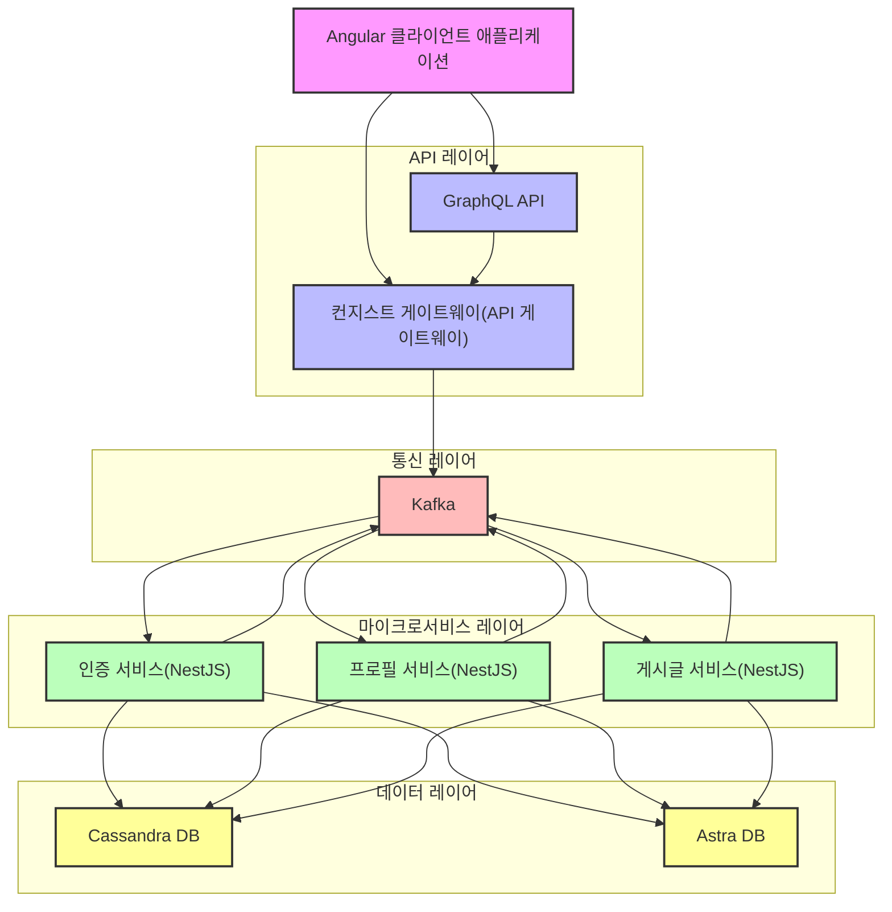
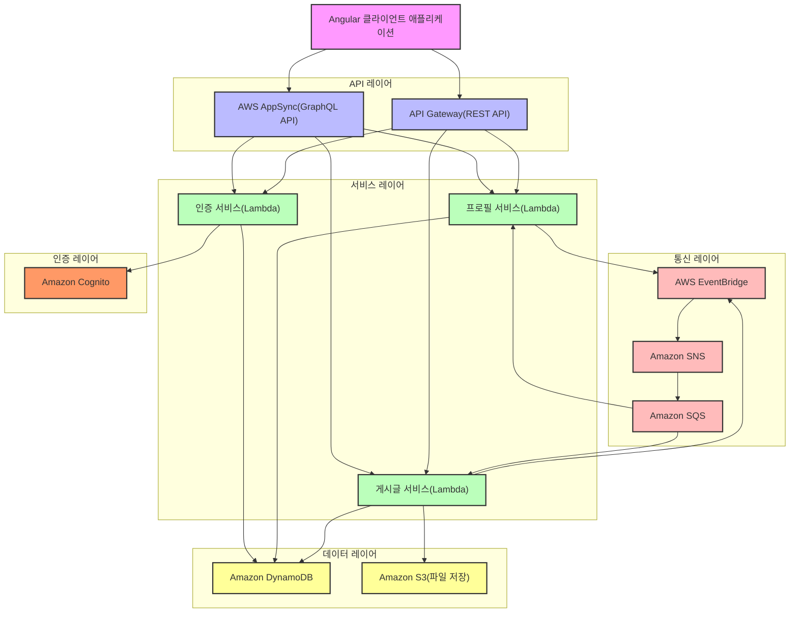

# Serverless-RealWorld

> ### AWS Serverless 마이그레이션 프로젝트: NestJS 마이크로서비스 아키텍처에서 AWS Serverless 아키텍처로 마이그레이션

## 레거시 아키텍처



## 목표 서버리스 아키텍처




이 프로젝트는 기존의 **NestJS** 마이크로서비스 아키텍처 기반 [RealWorld](https://github.com/gothinkster/realworld) 애플리케이션을 **AWS Serverless** 아키텍처로 마이그레이션하는 과정을 담고 있습니다. 바이브코딩(Vibe Coding)을 활용한 체계적인 마이그레이션 접근법을 통해 인프라 관리 부담을 줄이고, 확장성을 높이며, 비용 효율성을 개선하는 것이 목표입니다.

## 마이그레이션 목표

- **서버리스 아키텍처 전환**: 기존 NestJS 마이크로서비스에서 AWS Lambda 기반 서버리스 아키텍처로 전환
- **인프라 자동화**: AWS CDK(TypeScript)를 활용한 인프라 정의 및 배포 자동화
- **데이터 저장소 변경**: Cassandra DB에서 Amazon DynamoDB로 데이터 저장소 마이그레이션
- **서비스 간 통신 개선**: Kafka에서 AWS EventBridge, SNS/SQS로 이벤트 기반 통신 구현
- **사용자 경험 유지**: 기존 Angular 클라이언트 애플리케이션과의 호환성 유지

## 기술 스택

### 기존 아키텍처
- **프론트엔드**: Angular
- **백엔드**: NestJS 마이크로서비스
- **API**: GraphQL
- **메시징**: Kafka
- **데이터베이스**: Cassandra, Astra DB

### 새로운 아키텍처
- **프론트엔드**: Angular (기존 유지)
- **백엔드**: AWS Lambda (TypeScript)
- **API**: AWS AppSync (GraphQL), API Gateway (REST)
- **메시징**: AWS EventBridge, SNS/SQS
- **데이터베이스**: Amazon DynamoDB
- **인증**: Amazon Cognito, JWT
- **인프라**: AWS CDK (TypeScript), CloudFormation
- **CI/CD**: GitHub Actions 또는 AWS CodePipeline
- **모니터링**: AWS CloudWatch, X-Ray

## 바이브코딩을 활용한 마이그레이션 접근법

이 프로젝트는 바이브코딩 방법론을 활용하여 체계적이고 효율적인 마이그레이션을 진행합니다:

1. **PRD 작성**: 마이그레이션 요구사항과 목표를 명확히 정의한 PRD 문서 작성
2. **작업 세분화**: Task Master를 활용한 작업 세분화 및 복잡도 분석
3. **SOLID 원칙 적용**: 단일 책임 원칙(SRP)을 준수하는 작은 단위의 작업으로 분할
4. **Clean Architecture**: 계층 분리와 의존성 방향 관리를 통한 클린 아키텍처 구현
5. **테스트 주도 개발**: 각 기능 구현 전 테스트 작성 및 검증
6. **점진적 마이그레이션**: Strangler Fig Pattern을 활용한 점진적 마이그레이션 접근법

## 프로젝트 구조

```
/
├── cdk/                  # AWS CDK 인프라 코드
├── src/
│   ├── auth/             # 인증 서비스 Lambda 함수
│   ├── profile/          # 프로필 서비스 Lambda 함수
│   ├── article/          # 게시글 서비스 Lambda 함수
│   ├── common/           # 공통 유틸리티 및 모델
│   └── migration/        # 데이터 마이그레이션 스크립트
├── schema/               # GraphQL 스키마 정의
├── tests/                # 테스트 코드
├── scripts/              # 유틸리티 스크립트
├── tasks/                # Task Master 작업 정의
└── knowledgebase/        # 기존 아키텍처 문서
```

## 시작하기

### 사전 요구사항

- Node.js v18 이상
- AWS CLI v2 이상
- AWS CDK v2 이상
- AWS 계정 및 적절한 권한

### 개발 환경 설정

1. 저장소 복제:
   ```bash
   git clone https://github.com/serithemage/Serverless-RealWorld.git
   cd Serverless-RealWorld
   ```

2. 의존성 설치:
   ```bash
   npm install
   ```

3. AWS 환경 설정:
   ```bash
   aws configure
   ```

4. CDK 부트스트랩:
   ```bash
   cdk bootstrap
   ```

### 개발 워크플로우

Task Master를 사용하여 작업을 관리합니다:

```bash
# 작업 목록 확인
task-master list

# 다음 작업 확인
task-master next

# 작업 세분화
task-master expand --id=<task-id>

# 작업 상태 업데이트
task-master set-status --id=<task-id> --status=done
```

## 마이그레이션 로드맵

1. **기반 인프라 구축**: AWS CDK 프로젝트 설정 및 핵심 인프라 프로비저닝
2. **인증 시스템 구현**: Cognito 사용자 풀 설정 및 인증 Lambda 함수 구현
3. **API 레이어 구축**: AppSync GraphQL API 및 API Gateway 설정
4. **핵심 서비스 마이그레이션**: 프로필 서비스, 게시글 서비스 등 핵심 마이크로서비스 구현
5. **데이터 마이그레이션**: Cassandra에서 DynamoDB로 데이터 마이그레이션
6. **통합 및 테스트**: 모든 서비스 간 통합 테스트 및 최적화
7. **운영 준비**: CI/CD 파이프라인 구축 및 모니터링 설정

## 기여하기

이 프로젝트에 기여하고 싶으시다면 다음 가이드라인을 따라주세요:

1. 이슈 트래커에서 기존 이슈를 확인하거나 새 이슈를 생성합니다.
2. 작업할 이슈에 대한 브랜치를 생성합니다.
3. 변경 사항을 구현하고 테스트합니다.
4. Pull Request를 생성합니다.

## 라이센스

이 프로젝트는 MIT 라이센스 하에 배포됩니다. 자세한 내용은 [LICENSE](LICENSE) 파일을 참조하세요.
