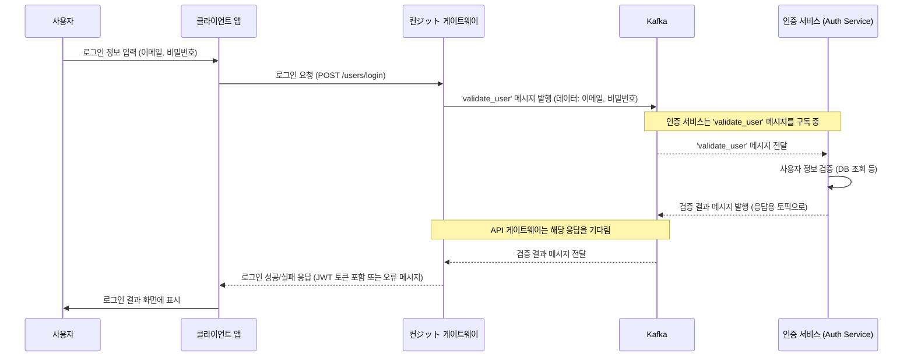

# Chapter 2: 마이크로서비스 아키텍처


지난 [Angular 클라이언트 애플리케이션](01_angular_클라이언트_애플리케이션_.md) 장에서는 사용자가 직접 마주하는 "쇼룸"에 해당하는 클라이언트 부분을 살펴보았습니다. 쇼룸이 멋지게 보이려면 그 뒤에서 상품을 준비하고 관리하는 잘 짜인 "주방" 또는 "공장"이 필요하겠죠? 이번 장에서는 우리 `Serverless-RealWorld` 애플리케이션의 백엔드 시스템을 구성하는 핵심 철학인 **마이크로서비스 아키텍처**에 대해 알아보겠습니다.

## 마이크로서비스 아키텍처란 무엇일까요?

여러분이 아주 큰 온라인 서점을 운영한다고 상상해 보세요. 이 서점에는 책 검색, 회원 관리, 주문 처리, 결제 등 다양한 기능이 필요합니다. 만약 이 모든 기능을 하나의 거대한 프로그램으로 만든다면 어떨까요?
*   **수정의 어려움**: 책 검색 기능 하나를 고치려 해도 전체 프로그램을 다시 테스트하고 배포해야 합니다.
*   **장애 전파**: 결제 기능에 문제가 생기면 서점 전체가 마비될 수 있습니다.
*   **확장의 비효율**: 특정 기능(예: 인기 도서 검색)에만 사용자가 몰려도, 전체 시스템을 통째로 확장해야 합니다.

**마이크로서비스 아키텍처(Microservices Architecture, MSA)**는 이러한 문제를 해결하기 위해 등장했습니다. 이름에서 알 수 있듯이, **"작은(Micro) 서비스(Service)들의 집합"**으로 시스템을 구축하는 방식입니다.

> 백엔드 시스템을 작고 독립적인 여러 서비스(예: 인증, 게시글, 프로필)로 나눈 구조입니다. 각 서비스는 특정 기능에만 집중하며, 마치 전문 분야별로 나뉜 의료진 팀과 같습니다. 각 전문의(서비스)는 자신의 전문 분야를 담당하고, 필요시 서로 협진([Kafka를 통한 서비스 간 통신](05_kafka를_통한_서비스_간_통신_.md)을 통해)하여 환자(시스템 전체 목표)를 치료합니다. 이를 통해 각 서비스는 독립적으로 개발, 배포, 확장이 용이해집니다.

우리 `Serverless-RealWorld` 프로젝트의 백엔드는 다음과 같은 주요 마이크로서비스들로 구성됩니다:

*   **인증 서비스 (Auth Service)**: 사용자의 회원가입, 로그인, 인증 토큰 발급 등 "신원 확인"을 담당하는 전문의입니다.
*   **게시글 서비스 (Article Service)**: 게시글 작성, 조회, 수정, 삭제 등 "게시글 관리"를 전문으로 합니다.
*   **프로필 서비스 (Profile Service)**: 사용자 프로필 정보 조회, 팔로우/언팔로우 등 "사용자 관계 및 정보"를 다룹니다.

이 외에도, 이 서비스들 앞단에는 모든 요청을 받아 적절한 서비스로 연결해주는 [컨ジット 게이트웨이 (API 게이트웨이)](03_컨ジット_게이트웨이__api_게이트웨이__.md)가 있습니다. 이는 마치 병원의 안내 데스크나 종합병원으로 들어가는 정문과 같은 역할을 합니다.

## 마이크로서비스는 어떻게 작동할까요? (사용자 로그인 예시)

사용자가 우리 웹사이트에서 로그인을 시도하는 과정을 통해 마이크로서비스가 어떻게 협력하는지 살펴봅시다.

1.  **쇼룸(클라이언트)에서 요청**: 사용자가 이메일과 비밀번호를 입력하고 로그인 버튼을 누릅니다. ([Angular 클라이언트 애플리케이션](01_angular_클라이언트_애플리케이션_.md)에서 처리)
2.  **안내 데스크(API 게이트웨이) 접수**: 클라이언트의 로그인 요청은 먼저 [컨ジット 게이트웨이 (API 게이트웨이)](03_컨ジット_게이트웨이__api_게이트웨이__.md)에 도달합니다.
3.  **전문의(인증 서비스) 호출**: API 게이트웨이는 이 요청이 "신원 확인"과 관련된 것임을 알고, "인증 서비스"에게 해당 업무를 전달합니다. (이 전달 과정은 [Kafka를 통한 서비스 간 통신](05_kafka를_통한_서비스_간_통신_.md)을 사용합니다.)
4.  **전문의(인증 서비스) 처리**: 인증 서비스는 전달받은 이메일과 비밀번호가 올바른지 확인합니다.
5.  **결과 회신**: 인증 서비스는 처리 결과를 다시 API 게이트웨이에게 알려줍니다.
6.  **최종 안내**: API 게이트웨이는 이 결과를 클라이언트에게 전달하여 사용자는 로그인 성공 또는 실패 메시지를 보게 됩니다.

이처럼 각 서비스는 자신의 전문 분야에만 집중하고, 필요할 때 서로 정보를 주고받으며 전체 시스템의 목표를 달성합니다.

## Serverless-RealWorld 프로젝트의 마이크로서비스 살펴보기

우리 프로젝트에서는 각 마이크로서비스가 독립적인 NestJS 애플리케이션으로 실행됩니다. `README.md` 파일에서 백엔드 서비스를 실행하는 명령어를 보면 이를 짐작할 수 있습니다.

```bash
# 프로젝트 루트의 README.md 중 일부
# 여러 서비스를 동시에 실행 (--projects=auth-service,conduit-gateway,profile-service,article-service)
nx run-many --target=serve --projects=auth-service,conduit-gateway,profile-service,article-service --parallel=4
```
이 명령어는 `auth-service`, `conduit-gateway`, `profile-service`, `article-service`라는 네 개의 독립적인 서비스를 실행하라는 의미입니다. (여기서 `conduit-gateway`는 다음 장에서 자세히 다룰 API 게이트웨이입니다.)

### 1. 독립적인 서비스 애플리케이션

각 서비스는 자신만의 시작점(`main.ts`)을 가지고 독립적으로 실행됩니다. 예를 들어, `article-service`의 시작점은 다음과 같습니다.

```typescript
// 파일: apps/article-service/src/main.ts
import { Logger } from '@nestjs/common';
import { NestFactory } from '@nestjs/core';
import { Transport, MicroserviceOptions } from '@nestjs/microservices'; // 마이크로서비스 설정
import { AppModule } from './app/app.module';

const logger = new Logger();

async function bootstrap() {
  const app = await NestFactory.createMicroservice<MicroserviceOptions>( // 일반 웹 앱이 아닌 마이크로서비스로 생성
    AppModule,
    {
      transport: Transport.KAFKA, // 통신 방식으로 Kafka 사용
      options: {
        client: {
          clientId: 'article-service', // 이 서비스의 고유 ID
          brokers: ['localhost:9092']  // Kafka 서버 주소
        },
        consumer: {
          groupId: 'article-service'    // Kafka 컨슈머 그룹 ID
        }
      }
    }
  );

  logger.log("Article-service is listening"); // 게시글 서비스 시작!
  await app.listen(); // 메시지 수신 대기
}

bootstrap();
```
-   `NestFactory.createMicroservice()`: NestJS 애플리케이션을 일반적인 웹 서버가 아닌, 다른 서비스와 메시지를 주고받는 마이크로서비스 형태로 생성합니다.
-   `transport: Transport.KAFKA`: 서비스 간 통신 방식으로 Kafka를 사용하도록 설정합니다. Kafka는 병원 내 의사들이 서로 안전하게 메시지를 주고받는 내부 메신저 시스템과 같습니다. 자세한 내용은 [Kafka를 통한 서비스 간 통신](05_kafka를_통한_서비스_간_통신_.md) 장에서 다룹니다.
-   `clientId: 'article-service'`: Kafka와 통신할 때 이 서비스를 식별하는 이름입니다.

`auth-service`와 `profile-service`의 `main.ts` 파일도 이와 매우 유사한 구조를 가집니다. 각자 고유한 `clientId` (예: `auth-service`, `profile-service`)를 가지고 Kafka에 연결됩니다.

```typescript
// 파일: apps/auth-service/src/main.ts (일부)
// ... import 생략 ...
async function bootstrap() {
  const app = await NestFactory.createMicroservice<MicroserviceOptions>(
    AppModule,
    {
      transport: Transport.KAFKA,
      options: { client: { clientId: 'auth-service', brokers: ['localhost:9092'] }, /* ... */ }
    },
  );
  // ... logger.log("Auth-service is listening"); ...
  await app.listen();
}
bootstrap();
```

```typescript
// 파일: apps/profile-service/src/main.ts (일부)
// ... import 생략 ...
async function bootstrap() {
  const app = await NestFactory.createMicroservice<MicroserviceOptions>(
    AppModule,
    {
      transport: Transport.KAFKA,
      options: { client: { clientId: 'profile-service', brokers: ['localhost:9092'] }, /* ... */ }
    }
  );
  // ... logger.log("Profile-service is listening"); ...
  await app.listen();
}
bootstrap();
```
이렇게 각 서비스가 독립적으로 실행되므로, 특정 서비스만 업데이트하거나 확장하는 것이 매우 용이합니다.

### 2. 서비스별 기능 담당: 컨트롤러와 메시지 패턴

각 마이크로서비스는 자신이 처리할 수 있는 요청(메시지)의 종류를 정의합니다. 이는 컨트롤러 파일 내에서 `@MessagePattern` 데코레이터를 사용하여 이루어집니다.

예를 들어, `article-service`의 `FeedController`는 게시글과 관련된 다양한 요청을 처리합니다. "모든 게시글 가져오기" 요청은 다음과 같이 처리됩니다.

```typescript
// 파일: apps/article-service/src/modules/feed/feed.controller.ts (일부)
import { Controller } from '@nestjs/common';
import { MessagePattern } from '@nestjs/microservices'; // 메시지 패턴 데코레이터
// ... 서비스들 import ...

@Controller()
export class FeedController {
  constructor(
    // ... 필요한 서비스 주입 (예: FeedService) ...
  ) { }

  @MessagePattern('get_all_articles') // 'get_all_articles' 라는 이름의 메시지를 처리
  handleGetAllArticles(currentUser) { // 메시지와 함께 전달된 데이터 (currentUser)
    // return this.feedService.getAll(currentUser); // 실제 게시글 조회 로직 호출
    console.log('[게시글 서비스] 모든 게시글 조회 요청 처리:', currentUser);
    // 실제로는 feedService를 통해 데이터베이스에서 게시글을 가져옵니다.
    return { articles: [{ title: '예시 게시글 1' }, { title: '예시 게시글 2' }] };
  }

  // ... ('create_article', 'update_article' 등 다른 메시지 패턴 처리 함수들) ...
}
```
-   `@MessagePattern('get_all_articles')`: 이 함수가 Kafka를 통해 전달되는 `'get_all_articles'`라는 이름의 메시지를 처리하도록 지정합니다. 마치 병원에서 "일반 진료 환자분 들어오세요"라고 안내하는 것과 같습니다.
-   `handleGetAllArticles(currentUser)`: 메시지를 받았을 때 실행될 함수입니다. `currentUser`와 같은 필요한 데이터를 메시지와 함께 받을 수 있습니다.

비슷하게, `auth-service`의 `UserController`는 사용자 인증과 관련된 메시지를 처리합니다.

```typescript
// 파일: apps/auth-service/src/modules/user/user.controller.ts (일부)
import { Controller } from '@nestjs/common';
import { MessagePattern } from '@nestjs/microservices';
// ... User, UserService 등 import ...

@Controller()
export class UserController {
  constructor(private readonly userService: UserService) { }

  @MessagePattern('validate_user') // 'validate_user' 메시지를 처리
  handleValidateUser(user: User) { // User 객체를 메시지로 받음
    // return this.userService.validateUser(user); // 실제 사용자 유효성 검사 로직 호출
    console.log('[인증 서비스] 사용자 유효성 검사 요청 처리:', user.email);
    // 실제로는 userService를 통해 데이터베이스 정보와 비교합니다.
    return { isValid: true, user: { email: user.email, token: 'jwt.token.here' } };
  }

  // ... ('user_creation', 'user_update' 등 다른 메시지 패턴 처리 함수들) ...
}
```
`@MessagePattern('validate_user')`는 `'validate_user'`라는 메시지를 수신하면 `handleValidateUser` 함수를 실행하여 사용자 인증을 시도합니다.

## 내부 동작 흐름: 사용자 로그인 상세

다시 한번 사용자 로그인 과정을 마이크로서비스 관점에서, 그리고 서비스 간 통신 수단인 Kafka를 포함하여 더 자세히 살펴보겠습니다.



이 그림에서 볼 수 있듯이, [컨ジット 게이트웨이 (API 게이트웨이)](03_컨ジット_게이트웨이__api_게이트웨이__.md)는 클라이언트의 HTTP 요청을 받아 Kafka 메시지로 변환하여 적절한 서비스(여기서는 인증 서비스)에 전달합니다. 각 마이크로서비스는 Kafka를 통해 자신에게 할당된 메시지만을 수신하고 처리한 후, 그 결과를 다시 Kafka를 통해 게이트웨이로 보내는 방식으로 동작합니다. 이 모든 통신은 비동기적으로 이루어질 수 있어 시스템 전체의 반응성을 높이는 데 기여합니다. ([Kafka를 통한 서비스 간 통신](05_kafka를_통한_서비스_간_통신_.md)에서 더 자세히 설명합니다.)

## 마이크로서비스 아키텍처의 장점

마이크로서비스 아키텍처를 사용하면 다음과 같은 장점들을 얻을 수 있습니다.

1.  **독립적인 개발 및 배포**: 각 서비스는 독립적인 작은 코드베이스를 가집니다. 인증 팀은 인증 서비스만, 게시글 팀은 게시글 서비스만 집중해서 개발하고 배포할 수 있습니다. 다른 서비스에 영향을 주지 않고 빠르게 기능을 개선하거나 버그를 수정할 수 있습니다.
2.  **기술 선택의 유연성**: 각 서비스의 특성에 맞는 최적의 프로그래밍 언어나 데이터베이스를 선택할 수 있습니다. (우리 `Serverless-RealWorld` 프로젝트에서는 모든 백엔드 서비스가 NestJS(Node.js)로 통일되어 있지만, 이론적으로는 가능합니다.)
3.  **확장성**: 특정 서비스에만 부하가 집중될 경우, 해당 서비스만 선택적으로 확장(더 많은 인스턴스를 실행)할 수 있습니다. 예를 들어, 사용자들이 게시글을 많이 읽는다면 게시글 서비스만 확장하면 됩니다. 전체 시스템을 불필요하게 확장할 필요가 없어 효율적입니다.
4.  **장애 격리 (탄력성)**: 하나의 서비스에 문제가 발생하더라도, 그 영향이 전체 시스템으로 퍼지는 것을 막을 수 있습니다. 예를 들어, 프로필 서비스가 일시적으로 응답하지 않더라도, 사용자들은 여전히 게시글을 읽거나 인증 기능을 사용할 수 있습니다.

## 정리하며

이번 장에서는 `Serverless-RealWorld` 애플리케이션의 백엔드가 어떻게 여러 개의 작고 독립적인 **마이크로서비스**로 구성되어 있는지 알아보았습니다. 각 서비스(인증, 게시글, 프로필 등)는 특정 기능에만 집중하며, 마치 전문 의료팀처럼 협력합니다. 이들은 NestJS를 기반으로 독립적인 애플리케이션으로 실행되며, [Kafka를 통한 서비스 간 통신](05_kafka를_통한_서비스_간_통신_.md)을 통해 메시지를 주고받습니다. 이를 통해 개발, 배포, 확장의 유연성을 얻고 시스템 전체의 안정성을 높일 수 있습니다.

하지만 이처럼 분산된 여러 서비스들을 외부의 클라이언트 애플리케이션이 어떻게 일관된 방식으로 호출하고 사용할 수 있을까요? 각 서비스의 주소를 모두 알아야 할까요? 바로 이 문제를 해결해주는 것이 다음 장에서 배울 [컨ジット 게이트웨이 (API 게이트웨이)](03_컨ジット_게이트웨이__api_게이트웨이__.md)입니다. API 게이트웨이는 모든 마이크로서비스로 향하는 단일 진입점 역할을 하며, 요청을 적절한 서비스로 라우팅하고 다양한 공통 기능을 처리합니다.

---

Generated by [AI Codebase Knowledge Builder](https://github.com/The-Pocket/Tutorial-Codebase-Knowledge)