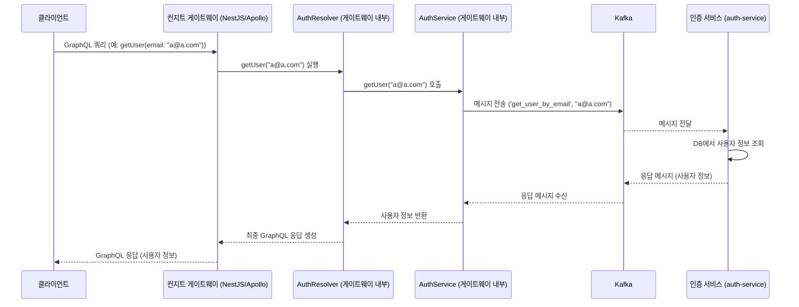

# Chapter 3: 컨지트 게이트웨이 (API 게이트웨이)


지난 [마이크로서비스 아키텍처](02_마이크로서비스_아키텍처_.md) 장에서는 우리 애플리케이션의 백엔드가 마치 전문 분야별 의사들처럼 여러 개의 독립적인 서비스(인증, 게시글, 프로필 서비스 등)로 나뉘어 작동한다는 것을 배웠습니다. 각 서비스는 자기 전문 분야에 집중하여 효율적으로 일할 수 있죠. 하지만 여기서 한 가지 질문이 생깁니다. 우리 병원(애플리케이션)을 찾아온 환자(클라이언트, 예: 웹 브라우저)는 어떤 의사(마이크로서비스)에게 먼저 말을 걸어야 할까요? 모든 의사의 진료실 위치와 전문 분야를 다 알고 있어야 할까요? 그렇게 되면 너무 복잡하겠죠!

바로 이 문제를 해결해주는 것이 이번 장에서 배울 **컨지트 게이트웨이(Conduit Gateway)**, 다른 이름으로는 **API 게이트웨이(API Gateway)**입니다.

## 컨지트 게이트웨이란 무엇일까요?

컨지트 게이트웨이는 클라이언트(예: 웹 브라우저, 모바일 앱)로부터 오는 모든 요청을 가장 먼저 받는 **단일 진입점**입니다. 마치 큰 종합병원의 **정문 안내 데스크**나 건물의 **문지기**와 같아요.

*   **안내 데스크 역할**: 방문객(클라이언트 요청)이 병원에 들어오면, 안내 데스크는 방문객의 목적을 파악하고 올바른 진료과(마이크로서비스)로 안내합니다. 클라이언트는 각 서비스의 복잡한 내부 구조나 주소를 알 필요 없이, 오직 이 게이트웨이와만 통신하면 됩니다.
*   **효율적인 소통 지원 (GraphQL)**: 컨지트 게이트웨이는 [GraphQL API 스키마 및 리졸버](04_graphql_api_스키마_및_리졸버_.md)를 사용하여 클라이언트가 필요한 데이터를 **정확하고 효율적으로 요청하고 받을 수 있도록** 돕습니다. 마치 환자가 "제 이름, 오늘 예약된 진료과, 그리고 담당 의사 선생님 성함만 알려주세요"라고 필요한 정보만 콕 집어 요청하는 것과 같습니다. 불필요한 정보까지 전부 다 받을 필요가 없어 효율적이죠.
*   **공통 업무 처리**: 모든 방문객에게 공통적으로 필요한 절차(예: 방문 기록 작성, 출입증 발급)를 안내 데스크에서 처리하듯, API 게이트웨이는 **인증**(정당한 사용자인지 확인), **요청 라우팅**(요청을 알맞은 서비스로 연결), 로깅(기록 남기기) 등 여러 서비스에 공통적으로 필요한 기능들을 처리합니다.

우리 `Serverless-RealWorld` 프로젝트에서 컨지트 게이트웨이는 클라이언트의 모든 요청을 받아, 이를 적절한 내부 마이크로서비스([인증 서비스](02_마이크로서비스_아키텍처_.md), [게시글 서비스](02_마이크로서비스_아키텍처_.md) 등)로 전달하고, 그 결과를 다시 클라이언트에게 돌려주는 핵심적인 역할을 합니다.

## 어떻게 작동할까요? (사용자 프로필과 게시글 목록 동시 조회 예시)

사용자가 "내 프로필 정보와 내가 최근에 작성한 게시글 5개를 보여줘!"라고 요청하는 상황을 상상해 봅시다. 이 정보는 사실 서로 다른 마이크로서비스에 저장되어 있을 가능성이 큽니다 (프로필 정보는 '프로필 서비스'에, 게시글 정보는 '게시글 서비스'에).

1.  **클라이언트의 단일 요청**: 클라이언트는 이 모든 정보를 얻기 위해 컨지트 게이트웨이에 단 하나의 GraphQL 요청을 보냅니다.
    ```graphql
    // 클라이언트가 게이트웨이로 보내는 가상의 GraphQL 요청
    query GetMyProfileAndArticles {
      me { // 내 프로필 정보 요청
        username
        email
        bio
      }
      myArticles(last: 5) { // 내 최근 게시글 5개 요청
        title
        createdAt
      }
    }
    ```
2.  **게이트웨이 접수 및 분석**: 컨지트 게이트웨이는 이 GraphQL 요청을 받습니다.
3.  **요청 분배 (라우팅)**: 게이트웨이 내부의 [GraphQL API 스키마 및 리졸버](04_graphql_api_스키마_및_리졸버_.md)는 이 요청을 분석하여, `me` 필드는 '프로필 서비스'로, `myArticles` 필드는 '게시글 서비스'로 각각 요청을 전달해야 함을 파악합니다. 이 전달은 내부적으로 [Kafka를 통한 서비스 간 통신](05_kafka를_통한_서비스_간_통신_.md)을 사용합니다.
4.  **마이크로서비스 처리**: 각 마이크로서비스는 자신에게 할당된 부분의 요청을 처리하고 결과를 게이트웨이로 다시 보냅니다.
5.  **응답 조합 및 최종 전달**: 게이트웨이는 프로필 서비스로부터 받은 프로필 정보와 게시글 서비스로부터 받은 게시글 목록을 GraphQL 요청 형식에 맞게 하나로 예쁘게 포장하여 클라이언트에게 최종적으로 전달합니다.

클라이언트는 마치 한 곳에서 모든 정보를 받은 것처럼 느끼지만, 실제로는 게이트웨이가 뒤에서 여러 서비스와 바쁘게 통신하며 조율한 결과입니다.

## 핵심 코드 살펴보기

이제 컨지트 게이트웨이가 실제로 어떻게 구현되어 있는지 주요 코드 조각들을 통해 살펴보겠습니다.

### 1. 게이트웨이 애플리케이션 시작: `main.ts`

모든 NestJS 애플리케이션처럼 컨지트 게이트웨이도 `main.ts` 파일에서 시작합니다.

```typescript
// 파일: apps/conduit-gateway/src/main.ts
import { Logger } from '@nestjs/common';
import { NestFactory } from '@nestjs/core';
import { AppModule } from './app/app.module'; // 게이트웨이의 핵심 설정 모듈

async function bootstrap() {
  const app = await NestFactory.create(AppModule); // AppModule을 기반으로 앱 인스턴스 생성
  const globalPrefix = 'api'; // 모든 API 경로 앞에 '/api'를 붙임
  app.setGlobalPrefix(globalPrefix);
  const port = process.env.PORT || 3333; // 3333번 포트 사용
  await app.listen(port); // 서버 실행 및 요청 대기
  Logger.log(
    `🚀 Application is running on: http://localhost:${port}/${globalPrefix}`
  );
}
bootstrap();
```
-   `NestFactory.create(AppModule)`: `AppModule`에 정의된 설정을 바탕으로 게이트웨이 애플리케이션을 만듭니다.
-   `app.listen(port)`: 지정된 포트(기본값 3333)에서 클라이언트의 HTTP 요청을 기다리기 시작합니다. 클라이언트의 [Angular 클라이언트 애플리케이션](01_angular_클라이언트_애플리케이션_.md)은 이 주소로 요청을 보내게 됩니다.

### 2. 게이트웨이의 중심, 모듈 설정: `app.module.ts`

`AppModule`은 게이트웨이가 어떤 기능들을 가지고 있고, 어떻게 동작해야 하는지 정의하는 설계도와 같습니다. 특히 GraphQL 설정을 눈여겨보세요.

```typescript
// 파일: apps/conduit-gateway/src/app/app.module.ts
import { Module } from '@nestjs/common';
import { GraphQLModule } from '@nestjs/graphql'; // GraphQL 사용을 위한 모듈
import { ApolloDriver, ApolloDriverConfig } from '@nestjs/apollo'; // Apollo 서버 드라이버

// 각 기능별 모듈들 (인증, 프로필, 게시글 관련 GraphQL 처리 담당)
import { AuthModule } from '../modules/auth/auth.module';
import { ProfileModule } from '../modules/profile/profile.module';
import { ArticleModule } from '../modules/article/article.module';

@Module({
  imports: [
    AuthModule,    // 인증 관련 API 로직
    ProfileModule, // 프로필 관련 API 로직
    ArticleModule, // 게시글 관련 API 로직
    GraphQLModule.forRoot<ApolloDriverConfig>({ // GraphQL 설정
      driver: ApolloDriver,            // Apollo 서버 사용
      autoSchemaFile: true,          // 스키마 자동 생성 (코드 우선 방식)
      include: [AuthModule, ProfileModule, ArticleModule], // 이 모듈들의 리졸버를 스키마에 포함
      // ... (CORS 설정 등)
    }),
  ],
  // controllers: [AppController], // 일반 REST API 컨트롤러 (지금은 GraphQL 위주)
  // providers: [AppService],
})
export class AppModule { }
```
-   `imports`: 게이트웨이가 사용할 다른 모듈들을 가져옵니다. `AuthModule`, `ProfileModule`, `ArticleModule`은 각각 인증, 프로필, 게시글과 관련된 GraphQL 요청을 처리하는 로직(리졸버와 서비스)을 담고 있습니다.
-   `GraphQLModule.forRoot<ApolloDriverConfig>({...})`: NestJS에서 GraphQL을 사용하기 위한 핵심 설정입니다.
    -   `driver: ApolloDriver`: GraphQL 서버로 Apollo Server를 사용하겠다는 의미입니다.
    -   `autoSchemaFile: true`: 코드를 기반으로 GraphQL 스키마 파일을 자동으로 생성합니다. 즉, 우리가 타입스크립트 코드로 정의한 데이터 모양과 리졸버 함수들이 자동으로 GraphQL 스키마로 변환됩니다. 자세한 내용은 [GraphQL API 스키마 및 리졸버](04_graphql_api_스키마_및_리졸버_.md) 장에서 다룹니다.
    -   `include: [...]`: `AuthModule`, `ProfileModule`, `ArticleModule`에 정의된 GraphQL 리졸버들을 자동으로 찾아 스키마에 포함시킵니다.

### 3. GraphQL 요청 처리의 시작점, 리졸버: `auth.resolver.ts`

리졸버(Resolver)는 특정 GraphQL 요청(쿼리 또는 뮤테이션)을 받았을 때 어떤 동작을 수행할지 정의하는 함수들의 모음입니다. 예를 들어, `AuthResolver`는 사용자 인증 및 정보 조회와 관련된 GraphQL 요청을 처리합니다.

```typescript
// 파일: apps/conduit-gateway/src/modules/auth/auth.resolver.ts (일부)
import { Args, Mutation, Query, Resolver } from "@nestjs/graphql";
import { AuthService } from "./auth.service"; // 실제 로직을 처리할 서비스
import { User } from "../../shared/types/user/user.dto"; // 사용자 데이터 타입
import { CreateUserInput } from "../../shared/types/user/input/create-user.input";
// ... (다른 필요한 타입 및 데코레이터 import) ...
import { UseGuards } from "@nestjs/common"; // Guard 사용
import { GraphQLAuthGuard } from "../../shared/jwt/jwt-auth.guard"; // 우리가 만든 인증 Guard

@Resolver() // 이 클래스가 GraphQL 리졸버임을 선언
export class AuthResolver {
  constructor(private readonly authService: AuthService) { } // AuthService 주입

  // 'user' 라는 이름의 GraphQL 쿼리를 처리하는 함수
  @Query(() => User) // 반환 타입은 User
  @UseGuards(GraphQLAuthGuard) // 이 쿼리는 인증된 사용자만 접근 가능!
  async getUser(@Args('email') email: string) { // 'email' 인자를 받음
    return this.authService.getUser(email); // authService의 getUser 함수 호출
  }

  // 'createUser' 라는 이름의 GraphQL 뮤테이션(데이터 변경)을 처리
  @Mutation(() => CreateUserOutput) // 반환 타입은 CreateUserOutput
  async createUser(@Args('user') user: CreateUserInput) {
    return this.authService.createUser(user); // authService의 createUser 함수 호출
  }
  // ... (loginUser, updateUser 등 다른 리졸버 함수들) ...
}
```
-   `@Resolver()`: 이 클래스가 GraphQL 리졸버임을 나타냅니다.
-   `constructor(private readonly authService: AuthService)`: `AuthService`를 주입받습니다. 리졸버는 보통 실제 로직 처리를 서비스 계층에 위임합니다.
-   `@Query(() => User)`: `getUser` 함수가 GraphQL `Query` (데이터 조회 요청) 중에서 `user`라는 필드를 처리하며, `User` 타입을 반환함을 나타냅니다.
-   `@UseGuards(GraphQLAuthGuard)`: 이 쿼리에 접근하기 전에 `GraphQLAuthGuard`라는 "경비원"이 먼저 사용자가 인증되었는지(로그인했는지) 검사합니다. 이것이 바로 게이트웨이가 "인증"이라는 공통 기능을 처리하는 예시입니다.
-   `@Args('email') email: string`: GraphQL 요청 시 `email`이라는 인자를 받아 `email` 변수에 저장합니다.
-   `this.authService.getUser(email)`: 실제 사용자 정보를 가져오는 로직은 `AuthService`의 `getUser` 함수에게 맡깁니다.

### 4. 마이크로서비스와 대화하는 서비스: `auth.service.ts`

게이트웨이의 서비스(`AuthService`, `ArticleService` 등)는 리졸버로부터 요청을 받아, 실제 데이터를 가진 백엔드 [마이크로서비스 아키텍처](02_마이크로서비스_아키텍처_.md)와 통신하는 역할을 합니다. 이 통신에는 [Kafka를 통한 서비스 간 통신](05_kafka를_통한_서비스_간_통신_.md)이 사용됩니다.

```typescript
// 파일: apps/conduit-gateway/src/modules/auth/auth.service.ts (일부)
import { Injectable, Inject, Logger, OnModuleInit } from '@nestjs/common';
import { ClientKafka } from '@nestjs/microservices'; // Kafka 클라이언트
import { map } from 'rxjs'; // Observable 데이터 변환용
// ... (User, CreateUserInput 등 타입 import) ...

const logger = new Logger();

@Injectable()
export class AuthService implements OnModuleInit {
  constructor(
    @Inject('AUTH-SERVICE') private readonly authClient: ClientKafka, // 'AUTH-SERVICE'라는 이름의 Kafka 클라이언트 주입
    // private jwtService: JwtService // JWT 토큰 생성/검증용 (여기서는 직접 사용 X)
  ) {}

  // 모듈 초기화 시 실행: Kafka 응답 토픽 구독
  onModuleInit() {
    // AUTH-SERVICE 마이크로서비스로부터 받을 응답들의 종류를 미리 알려줌
    this.authClient.subscribeToResponseOf('get_user_by_email');
    this.authClient.subscribeToResponseOf('user_creation');
    // ... (다른 응답 토픽 구독) ...
  }

  // 이메일로 사용자 정보 조회
  getUser(email: string) {
    logger.log(`GATEWAY - 인증 서비스로 'get_user_by_email' 메시지 전송: ${email}`);
    // 'get_user_by_email' 패턴으로 메시지를 AUTH-SERVICE로 보내고 응답을 기다림
    return this.authClient.send('get_user_by_email', email).pipe(
      map(r_user => r_user) // 받은 응답(r_user)을 그대로 반환
    );
  }

  // 새 사용자 생성
  createUser(user: CreateUserInput) {
    logger.log('GATEWAY - 인증 서비스로 "user_creation" 메시지 전송');
    return this.authClient.send('user_creation', user).pipe(
      map(newUser => { /* ... 응답 처리 로직 (예: 토큰 발급) ... */ return newUser; })
    );
  }
  // ... (login, updateUser 등 다른 함수들) ...
}
```
-   `@Inject('AUTH-SERVICE') private readonly authClient: ClientKafka`: `AuthModule` (또는 상위 모듈)에 등록된 `'AUTH-SERVICE'`라는 이름의 Kafka 클라이언트 인스턴스를 주입받습니다. 이 클라이언트를 통해 `auth-service` 마이크로서비스와 메시지를 주고받습니다.
-   `onModuleInit()`: 이 서비스가 초기화될 때 실행되는 함수입니다. `this.authClient.subscribeToResponseOf('메시지_패턴_이름')`은 특정 메시지 패턴에 대한 응답을 Kafka로부터 받기 위해 미리 "구독 신청"을 하는 것과 같습니다. 이렇게 해야 `send` 메소드가 응답을 제대로 받을 수 있습니다.
-   `this.authClient.send('get_user_by_email', email)`: `authClient`를 사용해 Kafka로 메시지를 보냅니다.
    -   첫 번째 인자 `'get_user_by_email'`은 메시지의 "이름표" 또는 "주제"와 같습니다. `auth-service` 마이크로서비스는 이 이름표를 가진 메시지를 받도록 설정되어 있습니다. ([마이크로서비스 아키텍처](02_마이크로서비스_아키텍처_.md) 장의 `MessagePattern` 참고)
    -   두 번째 인자 `email`은 메시지와 함께 전달할 데이터입니다.
-   `.pipe(map(r_user => r_user))`: `send` 함수는 `Observable`이라는 비동기 데이터 스트림을 반환합니다. `pipe`와 `map`은 이 스트림을 통해 전달된 응답 데이터를 가공하는 역할을 합니다. 여기서는 간단히 받은 데이터를 그대로 반환합니다.

이처럼 게이트웨이의 리졸버는 요청의 종류를 파악하고, 서비스는 해당 요청을 실제 마이크로서비스에 전달하는 "중간다리" 역할을 합니다.

## 내부 동작 흐름: 더 자세히 알아보기

클라이언트가 사용자 정보를 요청했을 때 컨지트 게이트웨이 내부에서는 어떤 일들이 순차적으로 일어날까요?

1.  **요청 수신**: 클라이언트가 `http://localhost:3333/api` (컨지트 게이트웨이 주소)로 GraphQL 요청을 보냅니다. (예: `getUser` 쿼리)
2.  **GraphQL 엔진 처리**: 게이트웨이의 GraphQL 엔진(Apollo Server)이 요청을 받아 파싱하고, 해당 쿼리에 연결된 리졸버(`AuthResolver`의 `getUser` 함수)를 찾아 실행합니다.
3.  **리졸버에서 서비스 호출**: `AuthResolver`의 `getUser` 함수는 주입받은 `AuthService`의 `getUser` 함수를 호출합니다.
4.  **서비스에서 Kafka 메시지 전송**: `AuthService`의 `getUser` 함수는 `authClient.send('get_user_by_email', email)`를 통해 `auth-service` 마이크로서비스로 메시지를 보냅니다. 이 메시지에는 "어떤 이메일의 사용자 정보를 원한다"는 내용이 담겨있습니다.
5.  **마이크로서비스 처리**: `auth-service` 마이크로서비스는 Kafka로부터 `'get_user_by_email'` 메시지를 수신하고, 데이터베이스에서 해당 이메일의 사용자 정보를 조회합니다.
6.  **마이크로서비스 응답**: `auth-service`는 조회 결과를 다시 Kafka를 통해 컨지트 게이트웨이로 응답 메시지를 보냅니다.
7.  **서비스에서 응답 수신**: 컨지트 게이트웨이의 `AuthService`는 Kafka로부터 응답을 받고, 필요한 경우 데이터를 가공합니다. (이 예시에서는 `map`을 통해 그대로 전달)
8.  **리졸버로 결과 반환**: `AuthService`는 처리 결과를 `AuthResolver`에게 반환합니다.
9.  **최종 응답 전송**: `AuthResolver`는 받은 결과를 GraphQL 형식에 맞게 최종 응답으로 만들어 클라이언트에게 전달합니다.

이 과정을 간단한 순서도로 표현하면 다음과 같습니다.



## 컨지트 게이트웨이의 장점

API 게이트웨이를 사용하면 다음과 같은 중요한 이점들이 있습니다.

*   **클라이언트 단순화**: 클라이언트는 수많은 마이크로서비스의 존재를 알 필요 없이, 오직 하나의 게이트웨이 주소만 기억하면 됩니다.
*   **캡슐화**: 백엔드 시스템의 내부 구조(어떤 마이크로서비스가 있고, 어떻게 통신하는지 등)를 클라이언트로부터 숨길 수 있습니다. 내부 구조가 변경되어도 게이트웨이만 적절히 수정하면 클라이언트는 영향을 받지 않습니다.
*   **요청 라우팅 및 조합**: 하나의 클라이언트 요청을 여러 마이크로서비스로 분산시키거나, 여러 마이크로서비스의 응답을 조합하여 하나의 응답으로 만들어 클라이언트에게 제공할 수 있습니다.
*   **중앙 집중식 공통 기능 처리**: 인증, 권한 부여, 로깅, 사용량 제한(rate limiting), 캐싱 등 여러 서비스에 공통적으로 필요한 기능들을 게이트웨이 한 곳에서 효율적으로 처리할 수 있습니다.

## 정리하며

이번 장에서는 `Serverless-RealWorld` 애플리케이션의 "정문 안내 데스크" 역할을 하는 **컨지트 게이트웨이(API 게이트웨이)**에 대해 자세히 알아보았습니다. 게이트웨이는 클라이언트에게 단일 진입점을 제공하고, GraphQL을 통해 효율적인 데이터 요청을 가능하게 하며, 내부적으로는 다양한 [마이크로서비스 아키텍처](02_마이크로서비스_아키텍처_.md)로 요청을 현명하게 분배하고 응답을 조합하는 중요한 역할을 수행합니다. 또한 인증과 같은 공통 기능도 처리해주죠. `main.ts`에서 시작하여, `AppModule`에서 GraphQL과 다른 기능 모듈들을 설정하고, 리졸버(`AuthResolver`)가 GraphQL 요청을 받아 서비스(`AuthService`)를 호출하면, 서비스가 [Kafka를 통한 서비스 간 통신](05_kafka를_통한_서비스_간_통신_.md)을 이용해 실제 마이크로서비스와 통신하는 흐름을 살펴보았습니다.

컨지트 게이트웨이가 클라이언트와 소통하는 핵심 언어는 바로 GraphQL입니다. 그렇다면 이 GraphQL 스키마는 어떻게 정의되고, 리졸버 함수들은 정확히 어떤 원리로 특정 요청을 처리하게 되는 걸까요?

다음 장인 [GraphQL API 스키마 및 리졸버](04_graphql_api_스키마_및_리졸버_.md)에서는 바로 이 GraphQL의 작동 방식과 우리 프로젝트에서 스키마와 리졸버가 어떻게 구성되는지 더 깊이 있게 탐구해 보겠습니다. 이를 통해 클라이언트와 서버가 어떻게 "대화의 규칙"을 정하고 데이터를 주고받는지 명확하게 이해할 수 있을 것입니다.

---

Generated by [AI Codebase Knowledge Builder](https://github.com/The-Pocket/Tutorial-Codebase-Knowledge)