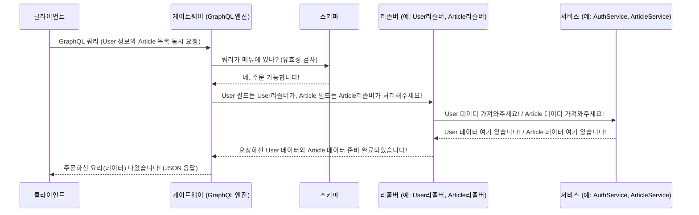

# Chapter 4: GraphQL API 스키마 및 리졸버


지난 [컨ジット 게이트웨이 (API 게이트웨이)](03_컨ジット_게이트웨이__api_게이트웨이__.md) 장에서는 우리 애플리케이션의 "정문 안내 데스크"인 컨ジット 게이트웨이가 클라이언트의 요청을 받아 내부 마이크로서비스로 전달하는 역할을 한다고 배웠습니다. 이때 게이트웨이는 클라이언트와 GraphQL이라는 특별한 언어로 소통한다고 했죠. 마치 손님(클라이언트)이 레스토랑(서버)에 와서 메뉴판을 보고 주문하는 것과 같습니다.

이번 장에서는 바로 이 "레스토랑의 메뉴판"에 해당하는 **GraphQL 스키마(Schema)**와, 주문받은 음식을 실제로 "조리하는 셰프" 역할을 하는 **리졸버(Resolver)**에 대해 자세히 알아보겠습니다. 이들을 이해하면 클라이언트가 어떻게 서버에게 원하는 데이터를 정확하고 효율적으로 요청하고 받을 수 있는지 명확히 알 수 있습니다.

## GraphQL 스키마와 리졸버란 무엇일까요? (고급 레스토랑 비유)

여러분은 친구의 프로필 정보(이름, 이메일)와 그 친구가 최근에 작성한 게시글 목록(제목, 작성일)을 한 화면에서 보고 싶다고 상상해 보세요. 기존 방식(REST API)이라면 프로필 정보를 가져오는 요청 한번, 게시글 목록을 가져오는 요청 한번, 이렇게 여러 번 서버에 요청해야 할 수도 있습니다. 하지만 손님 입장에서는 "딱 내가 원하는 정보만, 한 번에 주세요!"라고 하고 싶겠죠?

이것이 바로 GraphQL이 해결하려는 문제입니다! GraphQL은 클라이언트가 필요한 데이터의 구조를 직접 정의하여 요청할 수 있게 해줍니다. 마치 아주 상세한 **메뉴판(스키마)**과 유능한 **셰프(리졸버)**가 있는 고급 레스토랑과 같습니다.

*   **스키마 (Schema) - 상세한 메뉴판**:
    레스토랑 메뉴판에는 주문 가능한 모든 요리(데이터 타입), 각 요리를 구성하는 재료(필드), 그리고 "스테이크 굽기는 미디엄 레어로 해주세요" 같은 특별 주문 방법(쿼리, 뮤테이션)이 상세하게 적혀있습니다. GraphQL 스키마도 마찬가지입니다.
    *   **타입 (Type)**: API를 통해 주고받을 수 있는 데이터의 종류와 구조를 정의합니다. 예를 들어 '사용자 정보' 타입에는 '이메일', '사용자명', '소개' 등의 필드가 있을 수 있고, '게시글 정보' 타입에는 '제목', '내용', '작성자' 등의 필드가 있을 수 있습니다. (레스토랑의 '스테이크', '파스타', '샐러드' 같은 요리 종류)
    *   **쿼리 (Query)**: 서버로부터 데이터를 **읽어오거나 조회**할 때 사용합니다. (메뉴판에서 "오늘의 수프 주세요"라고 주문하는 것)
    *   **뮤테이션 (Mutation)**: 서버의 데이터를 **생성, 수정, 삭제**할 때 사용합니다. ( "파스타에 해산물 추가해주세요" 또는 "예약 취소할게요" 같은 요청)

*   **리졸버 (Resolver) - 유능한 셰프**:
    메뉴판에 적힌 각 요리(스키마의 필드)를 실제로 어떻게 만들어서 손님에게 제공할지 결정하고 실행하는 것이 셰프의 역할입니다. GraphQL 리졸버는 스키마에 정의된 특정 필드에 대한 요청이 들어왔을 때, 해당 데이터를 실제로 가져오거나 처리하는 함수입니다. 손님의 주문(클라이언트의 요청)에 따라 맞춤형 데이터를 준비해서 제공하는 것이죠.

우리 `Serverless-RealWorld` 프로젝트의 [컨ジット 게이트웨이 (API 게이트웨이)](03_컨ジット_게이트웨이__api_게이트웨이__.md)는 이 GraphQL 스키마를 클라이언트에게 제공하고, 클라이언트의 요청에 따라 해당 리졸버들을 실행하여 응답을 만들어냅니다.

## GraphQL 사용법: 클라이언트의 주문 (요청)

클라이언트는 서버가 제공하는 스키마(메뉴판)를 보고, 자신이 원하는 데이터만 콕콕 집어서 GraphQL 쿼리(주문서)를 작성하여 서버에 보냅니다.

예를 들어, "특정 사용자의 이메일과 사용자 이름, 그리고 모든 게시글의 제목 목록을 알려주세요!"라는 요청은 다음과 같은 GraphQL 쿼리로 표현할 수 있습니다.

```graphql
# 클라이언트가 게이트웨이로 보내는 GraphQL 요청 예시
query GetUserAndArticles {
  user(email: "friend@example.com") { # 'user' 쿼리로 특정 사용자 정보 요청
    email                            # 사용자 정보 중 이메일 필드
    username                         # 사용자 정보 중 사용자 이름 필드
  }
  articles {                         # 'articles' 쿼리로 모든 게시글 정보 요청
    title                            # 각 게시글의 제목 필드
  }
}
```

이 쿼리를 받은 서버는 다음과 같은 JSON 형식으로 응답할 것입니다.

```json
{
  "data": {
    "user": {
      "email": "friend@example.com",
      "username": "내친구"
    },
    "articles": [
      { "title": "첫 번째 방문 후기" },
      { "title": "GraphQL 정말 편리하네요!" },
      { "title": "주말 맛집 탐방기" }
    ]
  }
}
```

보시는 것처럼, 클라이언트는 자신이 요청한 `email`, `username`, `title` 필드의 데이터만 정확하게, 그리고 한 번의 요청으로 모두 받았습니다! 불필요한 데이터를 받거나 여러 번 요청할 필요가 없으니 매우 효율적이죠.

## 스키마 정의하기: 데이터의 모양 만들기 (NestJS 코드 우선 방식)

우리 `Serverless-RealWorld` 프로젝트의 [컨ジット 게이트웨이 (API 게이트웨이)](03_컨ジット_게이트웨이__api_게이트웨이__.md)는 NestJS 프레임워크를 사용하며, "코드 우선(code-first)" 방식으로 GraphQL 스키마를 정의합니다. 이는 우리가 타입스크립트 코드로 데이터의 모양(클래스)과 리졸버 함수를 작성하면, NestJS가 이를 바탕으로 자동으로 GraphQL 스키마를 생성해준다는 의미입니다. ([컨ジット 게이트웨이 (API 게이트웨이)](03_컨ジット_게이트웨이__api_게이트웨이__.md)의 `app.module.ts` 파일에서 `autoSchemaFile: true` 설정 덕분입니다.)

### 데이터 타입(ObjectType) 정의하기

데이터의 구조, 즉 스키마의 '타입'은 주로 `*.dto.ts` (Data Transfer Object) 파일에서 타입스크립트 클래스와 `@ObjectType()`, `@Field()` 같은 데코레이터(장식자)를 사용하여 정의합니다.

예를 들어, `User` 타입은 다음과 같이 정의할 수 있습니다.

```typescript
// 파일: apps/conduit-gateway/src/shared/types/user/user.dto.ts
import { ObjectType, Field } from "@nestjs/graphql"; // GraphQL 관련 데코레이터

@ObjectType() // 이 클래스가 GraphQL 스키마의 '객체 타입'임을 선언
export class User {
  @Field() // 이 속성이 해당 객체 타입의 '필드'임을 선언
  email: string; // 'email'이라는 이름의 문자열 필드

  @Field()
  username: string; // 'username'이라는 이름의 문자열 필드

  // @Field({ nullable: true }) // bio 필드는 선택적(null 가능)으로 정의할 수도 있습니다.
  // bio: string;
  // ... 기타 필드 (image 등)
}
```

-   `@ObjectType()`: `User` 클래스가 GraphQL 스키마에서 하나의 데이터 타입을 나타낸다는 것을 NestJS에게 알려줍니다.
-   `@Field()`: 클래스 속성(`email`, `username` 등)이 해당 GraphQL 타입의 필드가 된다는 것을 나타냅니다. 이 필드들을 클라이언트가 요청할 수 있게 됩니다.

`Article` 타입도 비슷하게 정의할 수 있습니다.

```typescript
// 파일: apps/conduit-gateway/src/shared/types/article/article.dto.ts
import { ObjectType, Field } from "@nestjs/graphql";
// import { Author } from "./author.dto"; // Article 타입 안에 Author 타입이 포함될 수도 있습니다.

@ObjectType()
export class Article {
  @Field()
  id: string;

  @Field()
  title: string;

  // @Field()
  // description: string;
  // ... 기타 필드 (body, author, createdAt 등)
}
```

이렇게 정의된 DTO 클래스들이 모여 GraphQL 스키마의 다양한 데이터 타입을 구성하게 됩니다.

### 쿼리(Query) 및 뮤테이션(Mutation) 타입 정의하기

스키마에서 데이터를 조회하는 진입점인 `Query` 타입과 데이터를 변경하는 진입점인 `Mutation` 타입은 리졸버 파일 내에서 `@Query()` 또는 `@Mutation()` 데코레이터가 붙은 함수들을 통해 자동으로 정의됩니다. 이 부분은 잠시 후 리졸버를 설명할 때 더 자세히 살펴보겠습니다.

## 리졸버 작성하기: 실제 데이터 준비 (셰프의 레시피)

리졸버는 스키마에 정의된 특정 필드에 대한 요청이 왔을 때, 그 요청을 실제로 처리하는 "셰프의 레시피"와 같은 함수들의 모음입니다. [컨ジット 게이트웨이 (API 게이트웨이)](03_컨ジット_게이트웨이__api_게이트웨이__.md)의 각 기능 모듈(예: `AuthModule`, `ArticleModule`)에는 해당 기능과 관련된 리졸버 파일(`*.resolver.ts`)이 존재합니다.

### 사용자 정보 조회 리졸버 예시 (`AuthResolver`)

사용자 정보를 조회하는 `user` 쿼리를 처리하는 리졸버 함수는 `apps/conduit-gateway/src/modules/auth/auth.resolver.ts` 파일에서 찾을 수 있습니다.

```typescript
// 파일: apps/conduit-gateway/src/modules/auth/auth.resolver.ts (일부)
import { Args, Query, Resolver } from "@nestjs/graphql";
import { AuthService } from "./auth.service"; // 실제 로직을 처리할 서비스
import { User } from "../../shared/types/user/user.dto"; // 반환될 데이터 타입

// @Resolver() 또는 @Resolver(() => User) 같이 특정 타입을 지정할 수도 있습니다.
@Resolver()
export class AuthResolver {
  constructor(private readonly authService: AuthService) {} // AuthService 주입

  // 'user'라는 이름의 GraphQL 쿼리를 정의하고, User 타입을 반환함을 명시
  @Query(() => User, { name: 'user' })
  async getUser(@Args('email') email: string): Promise<User> {
    // 클라이언트가 제공한 'email' 인자 값을 사용하여
    // authService의 getUser 메소드를 호출해 사용자 정보를 가져옵니다.
    return this.authService.getUser(email);
  }
  // ... 다른 쿼리나 뮤테이션 (예: loginUser, createUser) ...
}
```

-   `@Resolver()`: `AuthResolver` 클래스가 GraphQL 리졸버임을 나타냅니다.
-   `constructor(private readonly authService: AuthService)`: 리졸버는 보통 복잡한 로직 처리를 서비스 계층에 위임합니다. 여기서는 `AuthService`를 주입받아 사용합니다.
-   `@Query(() => User, { name: 'user' })`: `getUser` 함수가 `User` 타입을 반환하는 `user`라는 이름의 GraphQL 쿼리를 처리함을 선언합니다. 클라이언트가 스키마에서 `user(email: "...")` 형태로 쿼리를 요청하면 이 `getUser` 함수가 실행됩니다.
-   `@Args('email') email: string`: 클라이언트가 쿼리 시 `email`이라는 이름으로 전달한 인자 값을 `email` 매개변수로 받아옵니다.
-   `return this.authService.getUser(email);`: 실제 사용자 데이터를 조회하는 작업은 `AuthService`의 `getUser` 메소드에 맡깁니다. 이 서비스는 내부적으로 [Kafka를 통한 서비스 간 통신](05_kafka를_통한_서비스_간_통신_.md)을 통해 실제 인증 마이크로서비스로부터 데이터를 가져오는 역할을 합니다.

### 게시글 생성 뮤테이션 예시 (`ArticleResolver`)

새로운 게시글을 생성하는 `createArticle` 뮤테이션을 처리하는 리졸버 함수는 `apps/conduit-gateway/src/modules/article/article.resolver.ts` 파일에 있습니다.

```typescript
// 파일: apps/conduit-gateway/src/modules/article/article.resolver.ts (일부)
import { Args, Mutation, Resolver } from '@nestjs/graphql';
import { ArticleService } from './article.service'; // 실제 로직 처리 서비스
import { Article } from '../../shared/types/article/article.dto'; // 반환될 데이터 타입
// 입력 데이터 타입을 위한 import
import { CreateArticleInput } from '../../shared/types/article/input/create-article.input.ts';
// import { UseGuards } from '@nestjs/common'; // 인증 가드 사용
// import { GraphQLAuthGuard } from '../../shared/jwt/jwt-auth.guard'; // 우리가 만든 인증 가드

@Resolver()
export class ArticleResolver {
  constructor(private readonly articleService: ArticleService) {}

  // 'createArticle'이라는 이름의 GraphQL 뮤테이션을 정의하고, Article 타입을 반환
  @Mutation(() => Article, { name: 'createArticle' })
  // @UseGuards(GraphQLAuthGuard) // 실제로는 인증된 사용자만 게시글을 작성할 수 있도록 보호
  async createArticle(
    @Args('article') articleInput: CreateArticleInput // 클라이언트로부터 받은 게시글 정보
  ): Promise<Article> {
    // articleService의 create 메소드를 호출하여 실제 게시글 생성 로직 실행
    return this.articleService.create(articleInput);
  }
  // ... 다른 쿼리나 뮤테이션 (예: getAllArticles, updateArticle) ...
}
```

-   `@Mutation(() => Article, { name: 'createArticle' })`: `createArticle` 함수가 `Article` 타입을 반환하는 `createArticle`이라는 이름의 GraphQL 뮤테이션(데이터 변경 요청)을 처리함을 선언합니다.
-   `@Args('article') articleInput: CreateArticleInput`: 클라이언트가 뮤테이션 요청 시 `article`이라는 이름으로 전달한 입력 데이터를 `CreateArticleInput` 타입의 `articleInput` 매개변수로 받습니다. 이 `CreateArticleInput` 타입 또한 DTO 파일에 `@InputType()` 데코레이터를 사용하여 별도로 정의됩니다. (마치 특별 주문 시 작성하는 상세 요청서와 같습니다.)
-   `// @UseGuards(GraphQLAuthGuard)`: 주석 처리되어 있지만, 실제 애플리케이션에서는 이처럼 특정 쿼리나 뮤테이션에 접근하기 전에 사용자가 인증되었는지 확인하는 "경비원"(Guard)을 설정할 수 있습니다.

## 내부 동작 흐름: 주문부터 요리 완성까지

클라이언트가 GraphQL 요청을 보내면, [컨ジット 게이트웨이 (API 게이트웨이)](03_컨ジット_게이트웨이__api_게이트웨이__.md) 내부에서는 어떤 일들이 일어날까요?

1.  **주문 접수 (클라이언트 요청)**: 클라이언트가 GraphQL 쿼리(또는 뮤테이션)를 HTTP POST 요청 등을 통해 컨ジット 게이트웨이로 보냅니다.
2.  **메뉴판 확인 (파싱 및 유효성 검사)**: 게이트웨이에 내장된 GraphQL 엔진(우리 프로젝트에서는 Apollo Server)이 이 요청을 받습니다. 먼저 요청된 쿼리가 문법적으로 올바른지, 그리고 우리가 정의한 스키마(메뉴판)에 존재하는 필드와 타입들로 구성되어 있는지 확인합니다.
3.  **셰프 호출 (리졸버 실행)**: 유효성 검사를 통과하면, GraphQL 엔진은 쿼리에 명시된 각 필드에 대해 해당하는 리졸버 함수(셰프)를 찾아 실행합니다. 예를 들어, 클라이언트가 `user` 필드와 `articles` 필드를 요청했다면, `AuthResolver`의 `getUser` 함수와 `ArticleResolver`의 `getAllArticles` 함수가 각각 (또는 동시에) 실행될 수 있습니다.
4.  **재료 준비 (서비스 호출 및 데이터 조회)**: 각 리졸버 함수는 보통 실제 데이터를 가져오거나 처리하는 로직을 해당 서비스(예: `AuthService`, `ArticleService`)에 위임합니다. 이 서비스들은 필요에 따라 [Kafka를 통한 서비스 간 통신](05_kafka를_통한_서비스_간_통신_.md)을 이용하여 각 마이크로서비스(예: 인증 서비스, 게시글 서비스)로부터 데이터를 가져오거나 작업을 요청합니다.
5.  **요리 완성 및 서빙 (응답 조합 및 전송)**: 각 리졸버 함수가 실행되어 데이터를 반환하면, GraphQL 엔진은 이 데이터들을 클라이언트가 요청한 JSON 구조에 맞게 예쁘게 조합합니다. 그리고 이 최종 JSON 응답을 클라이언트에게 다시 보내줍니다.

이 전체 과정을 간단한 그림으로 표현하면 다음과 같습니다.



### 스키마 자동 생성의 비밀

앞서 "코드 우선" 방식으로 스키마를 정의한다고 했는데, 이 마법은 [컨ジット 게이트웨이 (API 게이트웨이)](03_컨ジット_게이트웨이__api_게이트웨이__.md)의 `apps/conduit-gateway/src/app/app.module.ts` 파일에 있는 `GraphQLModule` 설정 덕분입니다.

```typescript
// 파일: apps/conduit-gateway/src/app/app.module.ts (GraphQLModule 설정 부분)
// ... 다른 import 문들 ...
import { GraphQLModule } from '@nestjs/graphql';
import { ApolloDriver, ApolloDriverConfig } from '@nestjs/apollo';
import { AuthModule } from '../modules/auth/auth.module';
import { ProfileModule } from '../modules/profile/profile.module';
import { ArticleModule } from '../modules/article/article.module';

// ... @Module 데코레이터 내부 ...
  imports: [
    AuthModule,    // 인증 관련 GraphQL 로직 포함 모듈
    ProfileModule, // 프로필 관련 GraphQL 로직 포함 모듈
    ArticleModule, // 게시글 관련 GraphQL 로직 포함 모듈
    GraphQLModule.forRoot<ApolloDriverConfig>({
      driver: ApolloDriver,            // Apollo Server를 GraphQL 드라이버로 사용
      autoSchemaFile: true,          // 이 옵션이 핵심! 스키마 자동 생성 활성화
      include: [                     // 스키마 생성 시 참조할 모듈 목록
        AuthModule,
        ProfileModule,
        ArticleModule
      ],
      // ... (CORS 설정 등 기타 설정) ...
    }),
  ],
// ...
```

여기서 `autoSchemaFile: true` 옵션이 켜져 있기 때문에, NestJS는 `include` 배열에 명시된 모듈들(`AuthModule`, `ProfileModule`, `ArticleModule` 등) 안에 정의된 모든 `@Resolver()`, `@ObjectType()`, `@InputType()` 등을 스캔합니다. 그리고 이 정보를 바탕으로 GraphQL 스키마 정의 언어(SDL)로 작성된 스키마 파일(보통 `schema.gql`)을 자동으로 생성하거나, 애플리케이션 실행 시 메모리상에 스키마를 구축합니다. 덕분에 우리는 복잡한 스키마 언어를 직접 작성하는 대신, 익숙한 타입스크립트 코드로 API 명세를 관리할 수 있는 것입니다!

## 정리하며

이번 장에서는 GraphQL API의 핵심 구성 요소인 **스키마**와 **리졸버**에 대해 깊이 있게 알아보았습니다.

*   **스키마**는 클라이언트와 서버 간의 "계약서" 또는 "메뉴판"과 같습니다. API를 통해 어떤 데이터를 요청하고 받을 수 있는지 그 종류(타입)와 구조(필드), 그리고 데이터 조회 방법(쿼리) 및 변경 방법(뮤테이션)을 명확하게 정의합니다.
*   **리졸버**는 스키마에 정의된 각 필드에 대한 요청이 들어왔을 때, 실제로 데이터를 가져오거나 처리하는 "셰프"와 같은 함수입니다.
*   우리 `Serverless-RealWorld` 프로젝트에서는 NestJS의 **코드 우선(code-first)** 방식을 사용하여 타입스크립트 클래스와 데코레이터를 통해 스키마와 리졸버를 효율적으로 정의합니다. 이렇게 정의된 스키마와 리졸버는 [컨ジット 게이트웨이 (API 게이트웨이)](03_컨ジット_게이트웨이__api_게이트웨이__.md)에서 클라이언트의 GraphQL 요청을 지능적으로 처리하는 데 사용됩니다.

GraphQL을 사용함으로써 클라이언트는 자신이 필요한 데이터만 정확하게, 그리고 단 한 번의 요청으로 효율적으로 받을 수 있는 강력한 유연성을 얻게 됩니다. 이는 애플리케이션의 성능을 향상시키고 개발 경험을 즐겁게 만들어줍니다.

리졸버가 실제 데이터를 가져오기 위해 내부 마이크로서비스와 통신한다고 여러 번 언급했습니다. 이때 사용되는 핵심 기술 중 하나가 바로 **Kafka**입니다. 다음 장인 [Kafka를 통한 서비스 간 통신](05_kafka를_통한_서비스_간_통신_.md)에서는 이 마이크로서비스들 간의 비동기 메시지 통신이 구체적으로 어떻게 이루어지는지, 그리고 Kafka가 우리 시스템에서 어떤 중요한 역할을 하는지 자세히 살펴보겠습니다. 이를 통해 우리 애플리케이션의 전체적인 데이터 흐름을 더욱 명확하게 이해할 수 있을 것입니다.

---

Generated by [AI Codebase Knowledge Builder](https://github.com/The-Pocket/Tutorial-Codebase-Knowledge)