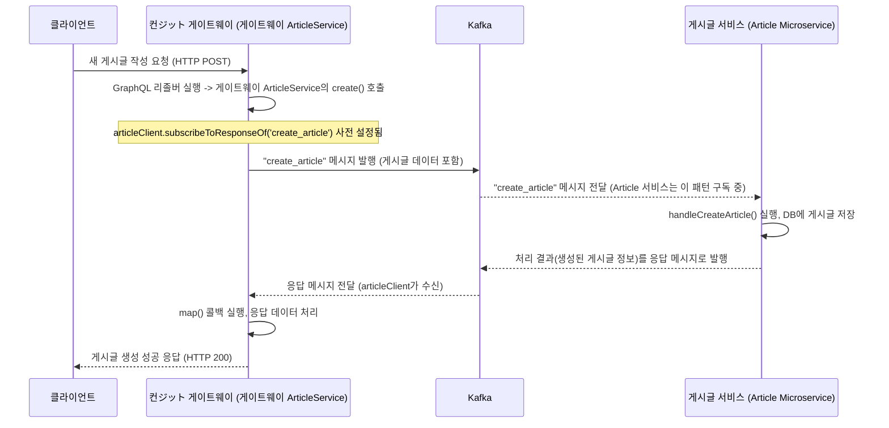

# Chapter 5: Kafka를 통한 서비스 간 통신


지난 [GraphQL API 스키마 및 리졸버](04_graphql_api_스키마_및_리졸버_.md) 장에서는 클라이언트와 [컨ジット 게이트웨이 (API 게이트웨이)](03_컨ジット_게이트웨이__api_게이트웨이__.md)가 마치 식당의 메뉴판(스키마)과 셰프(리졸버)처럼 GraphQL을 통해 소통하는 방법을 배웠습니다. 클라이언트가 특정 데이터를 요청하면, 게이트웨이의 리졸버가 해당 요청을 처리하기 위해 내부 로직을 실행합니다. 그런데 이 "내부 로직" 중 상당 부분은 게이트웨이 혼자 처리하는 것이 아니라, 전문화된 여러 [마이크로서비스 아키텍처](02_마이크로서비스_아키텍처_.md)들과 협력하여 이루어집니다. 예를 들어, 새 게시글을 작성하는 요청이 오면, 이 요청은 게시글을 전문적으로 다루는 '게시글 서비스'로 전달되어야 합니다.

그렇다면 이 게이트웨이와 여러 마이크로서비스들은 서로 어떻게 "대화"를 나눌까요? 한 서비스가 다른 서비스에게 직접 전화를 걸듯이 요청을 보내면, 만약 상대방 서비스가 바쁘거나 잠시 자리를 비웠다면(장애 발생) 어떻게 될까요? 요청한 서비스는 하염없이 기다리거나, 최악의 경우 전체 시스템에 문제가 퍼질 수도 있습니다.

이러한 문제를 해결하기 위해 우리 `Serverless-RealWorld` 프로젝트에서는 **아파치 카프카(Apache Kafka)**라는 강력한 도구를 사용하여 서비스 간의 효율적이고 안정적인 통신을 구현합니다.

## Kafka란 무엇일까요? (회사 내부 우편 시스템 비유)

카프카는 마이크로서비스들이 서로 **비동기적으로 메시지를 주고받는** 시스템입니다. 마치 회사 내의 잘 구축된 **내부 우편 시스템**과 같습니다.

> 한 부서(마이크로서비스)가 다른 부서에 직접 서류(요청/데이터)를 전달하는 대신, 회사 중앙 우편실의 특정 팀 앞으로 된 **공용 메일함(카프카 토픽)**에 서류를 넣어둡니다. 그러면 해당 메일함을 주기적으로 확인하는 담당 팀(메시지를 구독하는 마이크로서비스)이 서류를 가져가 처리합니다.

이러한 방식을 통해 다음과 같은 장점들이 생깁니다:
*   **결합도 감소 (Decoupling)**: 서류를 보내는 부서는 받는 부서가 지금 당장 일할 수 있는 상태인지, 심지어 누가 그 일을 처리하는지 정확히 알 필요가 없습니다. 그냥 정해진 메일함에 넣기만 하면 됩니다.
*   **유연성 및 안정성 향상**: 받는 부서가 잠시 자리를 비우거나 바쁘더라도, 서류는 메일함에 안전하게 보관되어 있다가 나중에 처리될 수 있습니다. 갑자기 많은 서류가 몰려와도 메일함이 버텨주는 한 시스템 전체가 마비되지 않습니다.

카프카의 핵심 구성 요소는 다음과 같습니다:

1.  **메시지 브로커 (Message Broker)**: 카프카 서버 자체를 의미하며, 모든 메시지를 중앙에서 관리하고 전달하는 우편 시스템의 핵심 역할을 합니다.
2.  **토픽 (Topic)**: 메시지가 저장되는 "메일함" 또는 "게시판"과 같습니다. 특정 종류의 메시지들이 모이는 곳입니다. 예를 들어, `article_creations` 토픽에는 게시글 생성과 관련된 메시지만 모입니다.
3.  **생산자 (Producer)**: 토픽으로 메시지를 보내는(발행하는) 주체입니다. 우리 프로젝트에서는 주로 [컨ジット 게이트웨이 (API 게이트웨이)](03_컨ジット_게이트웨이__api_게이트웨이__.md)의 서비스들이 이 역할을 합니다. (예: "새 게시글을 만들어줘!"라는 메시지를 발행)
4.  **소비자 (Consumer)**: 특정 토픽을 구독하고 있다가, 해당 토픽에 새로운 메시지가 도착하면 이를 가져와서 처리하는 주체입니다. 우리 프로젝트의 각 [마이크로서비스 아키텍처](02_마이크로서비스_아키텍처_.md)(예: 게시글 서비스, 인증 서비스)가 이 역할을 합니다.

## Serverless-RealWorld에서 Kafka는 어떻게 사용될까요? (게시글 작성 예시)

사용자가 새 게시글을 작성하는 상황을 예로 들어 Kafka가 어떻게 동작하는지 살펴봅시다.

1.  **클라이언트 요청**: 사용자가 웹사이트에서 게시글 제목과 내용을 입력하고 '발행' 버튼을 누릅니다. 이 요청은 먼저 [컨ジット 게이트웨이 (API 게이트웨이)](03_컨ジット_게이트웨이__api_게이트웨이__.md)로 전달됩니다.
2.  **게이트웨이의 역할 (생산자)**: 게이트웨이 내부의 [GraphQL API 스키마 및 리졸버](04_graphql_api_스키마_및_리졸버_.md)는 이 요청을 받아 `ArticleService` (게이트웨이 내부 서비스)를 호출합니다. 이 `ArticleService`는 Kafka 생산자 역할을 하여, "새 게시글 생성" 요청을 특정 카프카 토픽(예: `create_article` 메시지 패턴)으로 보냅니다. 이때, 게이트웨이는 응답을 받아야 하므로, 응답을 받을 "회신용 주소(reply topic)"도 함께 Kafka에게 알려줍니다.
3.  **Kafka의 역할 (메시지 전달)**: Kafka 브로커는 이 메시지를 받아 해당 토픽에 저장하고, 이 토픽을 구독하고 있는 소비자에게 전달합니다.
4.  **마이크로서비스의 역할 (소비자)**: `article-service` (게시글 마이크로서비스)는 `create_article` 메시지 패턴을 구독하고 있다가 이 메시지를 받습니다. 메시지에 담긴 게시글 정보를 사용하여 데이터베이스에 실제 게시글을 저장합니다.
5.  **응답 전송**: `article-service`는 처리 결과를 다시 Kafka를 통해 게이트웨이가 알려준 "회신용 주소"로 보냅니다.
6.  **게이트웨이의 최종 응답**: 게이트웨이는 Kafka로부터 `article-service`의 처리 결과를 받고, 이를 최종적으로 클라이언트에게 응답합니다.

여기서 중요한 점은 게이트웨이가 `article-service`에게 직접 요청을 보내는 것이 아니라, Kafka라는 "중개인"을 통한다는 것입니다. 이로 인해 `article-service`가 잠시 응답이 없더라도 메시지는 Kafka에 안전하게 보관되며, 시스템 전체의 안정성이 높아집니다.

## 핵심 코드 살펴보기

이제 Kafka를 사용한 서비스 간 통신이 코드에서는 어떻게 구현되는지 살펴보겠습니다.

### 1. 마이크로서비스: Kafka 메시지 수신 준비 (`main.ts`)

각 마이크로서비스(예: `article-service`, `auth-service`)는 시작할 때 자신이 Kafka를 통해 메시지를 주고받을 것임을 NestJS 프레임워크에 알려줘야 합니다.

```typescript
// 파일: apps/article-service/src/main.ts
import { Logger } from '@nestjs/common';
import { NestFactory } from '@nestjs/core';
// Kafka 통신을 위한 Transport, MicroserviceOptions 가져오기
import { Transport, MicroserviceOptions } from '@nestjs/microservices';
import { AppModule } from './app/app.module';

const logger = new Logger();

async function bootstrap() {
  // 일반 웹 애플리케이션이 아닌, 마이크로서비스로 애플리케이션 생성
  const app = await NestFactory.createMicroservice<MicroserviceOptions>(
    AppModule, // 이 서비스의 주요 설정이 담긴 모듈
    {
      transport: Transport.KAFKA, // 통신 방식으로 Kafka 사용 명시
      options: {
        client: { // Kafka 클라이언트 설정
          clientId: 'article-service', // 이 서비스의 고유 ID (Kafka 브로커에게 자신을 알림)
          brokers: ['localhost:9092']  // 접속할 Kafka 브로커 주소 목록
        },
        consumer: { // Kafka 소비자 설정
          groupId: 'article-service'    // 이 소비자가 속한 그룹 ID (같은 그룹 내 소비자는 메시지를 나눠서 처리)
        }
      }
    }
  );

  logger.log("Article-service is listening for Kafka messages"); // 서비스 시작 및 메시지 대기
  await app.listen(); // Kafka로부터 메시지를 수신 시작
}
bootstrap();
```

-   `NestFactory.createMicroservice()`: NestJS 애플리케이션을 일반 웹 서버가 아닌, 다른 서비스와 메시지를 주고받는 마이크로서비스 형태로 생성합니다.
-   `transport: Transport.KAFKA`: 서비스 간 통신 방식으로 Kafka를 사용하도록 명시합니다.
-   `client: { clientId: 'article-service', brokers: ['localhost:9092'] }`: 이 서비스가 Kafka와 통신할 때 사용할 ID (`article-service`)와 접속할 Kafka 브로커의 주소(`localhost:9092`)를 설정합니다. `clientId`는 Kafka 브로커가 각 클라이언트를 식별하는 데 사용됩니다.
-   `consumer: { groupId: 'article-service' }`: 이 서비스가 Kafka 메시지를 소비할 때 속할 컨슈머 그룹의 ID를 지정합니다. 같은 `groupId`를 가진 여러 서비스 인스턴스가 있다면, Kafka는 토픽의 메시지를 이들에게 분산하여 전달합니다 (로드 밸런싱 효과).

`auth-service`의 `main.ts`나 `profile-service`의 `main.ts`도 이와 매우 유사한 구조로 Kafka 통신 설정을 갖습니다. (`clientId`와 `groupId`는 각 서비스에 맞게 다릅니다.)

### 2. 마이크로서비스: 특정 메시지 처리하기 (`*.controller.ts`)

마이크로서비스는 어떤 종류의 메시지를 처리할지 `@MessagePattern()` 데코레이터를 사용하여 정의합니다. 이는 Kafka 토픽의 메시지 중 특정 "이름표(패턴)"를 가진 메시지만 골라서 처리하겠다는 의미입니다.

```typescript
// 파일: apps/article-service/src/modules/feed/feed.controller.ts (일부)
import { Controller } from '@nestjs/common';
// MessagePattern 데코레이터 가져오기
import { MessagePattern } from '@nestjs/microservices';
// ... FeedService 등 실제 로직을 처리할 서비스 import ...

@Controller()
export class FeedController {
  constructor(private readonly feedService: FeedService) { }

  // 'create_article' 패턴의 Kafka 메시지를 받으면 이 함수 실행
  @MessagePattern('create_article')
  handleCreateArticle(articleData) { // 메시지와 함께 전달된 데이터 (게시글 정보)
    console.log('[게시글 서비스] "create_article" 메시지 수신:', articleData.title);
    // 실제로는 feedService를 호출하여 게시글을 생성하고 DB에 저장합니다.
    return this.feedService.createArticle(articleData);
  }

  // 'get_all_articles' 패턴의 Kafka 메시지를 받으면 이 함수 실행
  @MessagePattern('get_all_articles')
  handleGetAllArticles(currentUser) {
    console.log('[게시글 서비스] "get_all_articles" 메시지 수신');
    return this.feedService.getAll(currentUser);
  }
  // ... (다른 메시지 패턴 처리 함수들) ...
}
```

-   `@MessagePattern('create_article')`: 이 함수가 Kafka를 통해 전달되는 메시지 중, `'create_article'`이라는 이름표(패턴)를 가진 메시지를 처리하도록 지정합니다. [컨ジット 게이트웨이 (API 게이트웨이)](03_컨ジット_게이트웨이__api_게이트웨이__.md)에서 이 패턴으로 메시지를 보내면 이 함수가 호출됩니다.
-   `handleCreateArticle(articleData)`: 메시지를 받았을 때 실행될 함수입니다. `articleData` 매개변수를 통해 메시지와 함께 전달된 데이터(예: 생성할 게시글의 제목, 내용 등)를 받을 수 있습니다.
-   `return this.feedService.createArticle(articleData);`: 실제 비즈니스 로직은 `FeedService`와 같은 서비스 계층에 위임하고, 그 결과를 반환합니다. 이 반환 값은 Kafka를 통해 다시 요청을 보낸 곳(게이트웨이)으로 전달됩니다.

`auth-service`의 `UserController`도 비슷한 방식으로 `@MessagePattern('validate_user')` 등을 사용하여 인증 관련 메시지를 처리합니다.

### 3. 게이트웨이: Kafka로 메시지 보내고 응답받기 (`*.service.ts`)

[컨ジット 게이트웨이 (API 게이트웨이)](03_컨ジット_게이트웨이__api_게이트웨이__.md) 내부의 서비스(예: `AuthService`, `ArticleService`)는 `ClientKafka`라는 특수한 클라이언트를 사용하여 특정 마이크로서비스로 메시지를 보내고 응답을 기다립니다.

```typescript
// 파일: apps/conduit-gateway/src/modules/article/article.service.ts (일부)
import { Injectable, Inject, Logger, OnModuleInit } from '@nestjs/common';
// Kafka 클라이언트 ClientKafka 가져오기
import { ClientKafka } from '@nestjs/microservices';
import { map } from 'rxjs'; // Observable 데이터 변환용
import { CreateArticleInput } from '../../shared/types/article/input/create-article.input';

const logger = new Logger();
@Injectable()
export class ArticleService implements OnModuleInit {
  constructor(
    // 'ARTICLE-SERVICE'라는 이름으로 등록된 ClientKafka 인스턴스 주입
    @Inject('ARTICLE-SERVICE') private readonly articleClient: ClientKafka
  ) { }

  // 서비스 초기화 시, 특정 메시지 패턴에 대한 응답을 구독하도록 설정
  onModuleInit() {
    this.articleClient.subscribeToResponseOf('create_article');
    this.articleClient.subscribeToResponseOf('get_all_articles');
    // ... (다른 응답 패턴 구독) ...
  }

  // 새 게시글 생성 요청을 Article 마이크로서비스로 전송
  create(article: CreateArticleInput) {
    logger.log('GATEWAY - Article 서비스로 "create_article" 메시지 전송 중...');
    // 'create_article' 패턴으로 article 데이터를 담아 메시지 전송
    // send()는 Observable을 반환하며, 응답이 오면 map을 통해 처리
    return this.articleClient.send('create_article', article).pipe(
      map(newArticle => { // Article 서비스로부터 받은 응답 (새로 생성된 게시글)
        logger.log('GATEWAY - Article 서비스로부터 응답 받음:', newArticle.title);
        return newArticle;
      })
    );
  }
  // ... (getAll, update 등 다른 함수들도 유사하게 articleClient.send() 사용) ...
}
```

-   `@Inject('ARTICLE-SERVICE') private readonly articleClient: ClientKafka`: 게이트웨이의 모듈 설정 파일(`article.module.ts` 또는 `app.module.ts`)에 미리 정의된 `'ARTICLE-SERVICE'`라는 이름의 `ClientKafka` 인스턴스를 주입받습니다. 이 `articleClient`를 통해 `article-service` 마이크로서비스와 통신합니다.
-   `onModuleInit()`: 서비스가 초기화될 때 실행됩니다. `this.articleClient.subscribeToResponseOf('create_article')`는 `'create_article'` 패턴으로 메시지를 보냈을 때, 해당 마이크로서비스로부터 응답을 받기 위해 "응답 수신 채널"을 미리 열어두는 것과 같습니다. 이렇게 해야 `send()` 메소드가 보낸 요청에 대한 응답을 제대로 받을 수 있습니다.
-   `this.articleClient.send('create_article', article)`: `articleClient`를 사용하여 Kafka로 메시지를 보냅니다.
    -   첫 번째 인자 `'create_article'`은 메시지의 패턴 이름입니다. `article-service`는 이 패턴을 `@MessagePattern('create_article')`으로 구독하고 있습니다.
    -   두 번째 인자 `article`은 메시지와 함께 전달할 데이터(게시글 정보)입니다.
-   `.pipe(map(newArticle => ...))`: `send()` 함수는 `Observable`이라는 비동기 데이터 스트림을 반환합니다. `map` 연산자는 이 스트림을 통해 전달된 응답 데이터(마이크로서비스가 처리하고 반환한 값)를 가공하는 역할을 합니다. 여기서는 받은 데이터를 그대로 반환하거나 로그를 남깁니다.

`AuthService` (게이트웨이 내)도 `authClient.send('validate_user', userData)` 와 같이 유사한 방식으로 `auth-service` 마이크로서비스와 통신합니다.

## 내부 동작 흐름 요약: 메시지는 어떻게 전달될까요?

클라이언트가 새 게시글 작성을 요청했을 때부터 응답을 받기까지 Kafka를 통한 내부 통신 흐름을 간단히 나타내면 다음과 같습니다.



이 그림에서 볼 수 있듯이, 게이트웨이와 마이크로서비스는 직접 통신하는 대신 Kafka라는 "우편 시스템"을 통해 메시지를 주고받습니다. NestJS의 `ClientKafka`와 `@MessagePattern`은 이러한 요청-응답 스타일의 통신을 Kafka 위에서 편리하게 구현할 수 있도록 도와줍니다. 실제로는 메시지를 보내고 바로 응답을 기다리지 않는 "발행-구독(Publish-Subscribe)" 패턴만 사용할 수도 있지만, 우리 프로젝트에서는 클라이언트 요청에 대한 응답을 제공해야 하므로 이와 같은 요청-응답 패턴을 사용합니다.

## Kafka 사용의 이점

서비스 간 통신에 Kafka를 사용하면 다음과 같은 주요 이점을 얻을 수 있습니다.

1.  **느슨한 결합 (Decoupling)**: 서비스를 보내는 쪽(생산자)과 받는 쪽(소비자)이 서로의 존재나 상태를 직접 알 필요가 없습니다. 각자 Kafka의 특정 토픽(메시지 패턴)만 바라보고 작업합니다.
2.  **비동기 처리 기반**: 요청을 보낸 서비스는 메시지가 Kafka에 안전하게 전달되기만 하면 일단 자신의 다음 일을 할 수 있습니다. (우리 프로젝트의 `send()`는 응답을 기다리지만, Kafka 자체는 완전한 비동기 통신을 지원합니다.)
3.  **회복탄력성 및 내결함성 (Resilience & Fault Tolerance)**: 특정 소비자 서비스가 일시적으로 다운되더라도, 해당 서비스로 가야 할 메시지는 Kafka에 안전하게 보관됩니다. 서비스가 다시 정상화되면 밀렸던 메시지들을 처리할 수 있습니다.
4.  **확장성 (Scalability)**: Kafka 자체도 여러 서버로 확장 가능하며, 특정 토픽의 메시지를 처리하는 소비자 그룹의 서비스 인스턴스 수도 늘려서 처리량을 높일 수 있습니다.
5.  **메시지 로깅 및 추적**: Kafka는 모든 메시지를 로그 형태로 저장하므로, 필요시 메시지 흐름을 추적하거나 장애 분석에 활용할 수 있습니다 (Kafdrop 같은 도구 사용).

## 정리하며

이번 장에서는 `Serverless-RealWorld` 애플리케이션의 여러 [마이크로서비스 아키텍처](02_마이크로서비스_아키텍처_.md)들이 어떻게 **Kafka**를 통해 서로 메시지를 주고받는지 알아보았습니다. Kafka는 마치 효율적인 회사 내부 우편 시스템처럼 동작하여, [컨ジット 게이트웨이 (API 게이트웨이)](03_컨ジット_게이트웨이__api_게이트웨이__.md) (메시지 생산자)와 각 마이크로서비스(메시지 소비자) 간의 통신을 담당합니다.

-   마이크로서비스는 시작 시(`main.ts`) Kafka 통신 설정을 하고, 컨트롤러(`*.controller.ts`)에서 `@MessagePattern()`을 사용하여 특정 종류의 메시지를 처리할 함수를 지정합니다.
-   게이트웨이의 서비스(`*.service.ts`)는 `ClientKafka`를 주입받아 `send()` 메소드로 마이크로서비스에 요청 메시지를 보내고, `subscribeToResponseOf()`를 통해 응답을 받습니다.

이러한 Kafka 기반의 메시징 시스템 덕분에 우리 애플리케이션은 서비스 간의 의존성을 낮추고, 시스템 전체의 유연성, 안정성, 확장성을 높일 수 있습니다.

이제 서비스들이 서로 어떻게 통신하는지 알았으니, 다음 질문은 "각 마이크로서비스는 전달받은 요청(메시지)을 바탕으로 실제 데이터는 어떻게 다루고 비즈니스 로직은 어떻게 처리할까?" 일 것입니다.

다음 장인 [리포지토리 및 도메인 서비스](06_리포지토리_및_도메인_서비스_.md)에서는 각 마이크로서비스 내부에서 데이터베이스와의 상호작용을 담당하는 **리포지토리(Repository)** 패턴과 핵심 비즈니스 로직을 캡슐화하는 **도메인 서비스(Domain Service)**에 대해 자세히 살펴보겠습니다. 이를 통해 개별 서비스가 어떻게 자신의 책임을 효과적으로 수행하는지 이해할 수 있을 것입니다.

---

Generated by [AI Codebase Knowledge Builder](https://github.com/The-Pocket/Tutorial-Codebase-Knowledge)