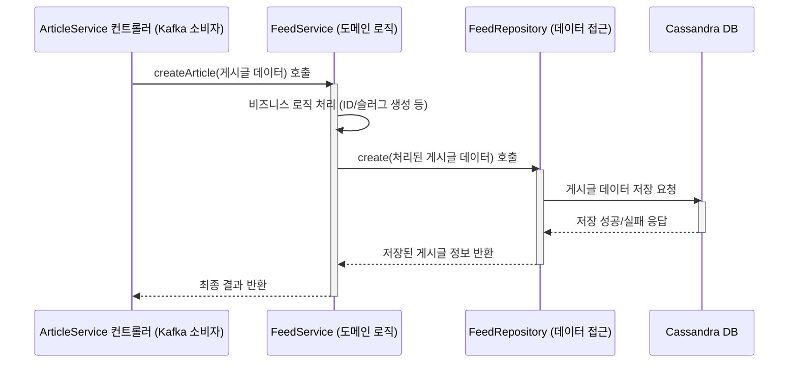

# Chapter 6: 리포지토리 및 도메인 서비스


지난 [Kafka를 통한 서비스 간 통신](05_kafka를_통한_서비스_간_통신_.md) 장에서는 우리 애플리케이션의 여러 마이크로서비스들이 어떻게 Kafka라는 메시지 시스템을 통해 서로 "대화"하는지 배웠습니다. 게이트웨이가 클라이언트의 요청을 받아 Kafka 메시지로 변환하여 적절한 마이크로서비스에 전달하면, 이제 그 메시지를 받은 서비스는 실제 업무를 처리해야 합니다. 예를 들어, "새로운 게시글을 작성해줘!"라는 메시지를 받은 '게시글 서비스'는 이 요청을 어떻게 처리하고, 게시글 데이터를 어디에, 어떻게 저장할까요?

이번 장에서는 각 마이크로서비스 내부에서 이러한 **데이터 관리와 핵심 업무 규칙(비즈니스 로직)을 깔끔하게 처리하는 방법**인 **리포지토리(Repository)** 패턴과 **도메인 서비스(Domain Service)**에 대해 알아보겠습니다. 이들을 이용하면 서비스의 코드가 훨씬 더 체계적이고 이해하기 쉬워집니다.

## 무엇이 문제일까요? (사서와 복잡한 요청 처리)

만약 '게시글 서비스'가 Kafka로부터 "새 게시글 작성" 요청을 받았다고 해봅시다. 이 서비스는 다음의 일들을 해야 합니다:
1.  게시글 데이터(제목, 내용, 작성자 등)를 데이터베이스에 저장해야 합니다.
2.  만약 게시글에 태그가 있다면, 태그 정보도 처리해야 합니다.
3.  혹시 같은 제목의 게시글이 이미 있는지 확인해야 할 수도 있습니다 (중복 방지 규칙).
4.  이 모든 과정에서 오류가 발생하면 적절히 대응해야 합니다.

이 모든 로직을 마이크로서비스의 요청 처리 함수(예: 컨트롤러 핸들러) 한 곳에 전부 작성한다면 코드가 매우 길고 복잡해질 것입니다. 마치 도서관 사서가 책 정리, 대출, 반납, 신규 도서 등록, 희귀 도서 검색 요청 처리까지 혼자 다 하려는 것과 같습니다. 업무가 뒤죽박죽되고 효율이 떨어지겠죠.

**리포지토리**와 **도메인 서비스**는 이러한 문제를 해결하기 위해 등장했습니다.
*   **리포지토리**: 특정 주제(데이터)의 "전문 사서"입니다. 데이터베이스와의 소통을 전담하여 데이터를 저장하고, 조회하고, 수정하고, 삭제하는 역할을 합니다.
*   **도메인 서비스**: 이 "전문 사서(리포지토리)"들을 활용하여 복잡한 이용자 요청(비즈니스 규칙)을 처리하는 "상황실 팀장"과 같습니다.

## 리포지토리 (Repository): 데이터베이스의 주제별 사서

리포지토리는 애플리케이션의 특정 데이터 모델(예: 사용자, 게시글, 댓글)에 대한 데이터 접근 로직을 캡슐화하는 객체입니다. 쉽게 말해, 특정 주제의 책(데이터)을 전문적으로 관리하는 **도서관의 주제별 사서**와 같습니다.

*   **역할**: 데이터베이스에 직접 SQL 쿼리를 날리거나, 특정 ORM(Object-Relational Mapper)의 복잡한 사용법을 몰라도 되도록, 데이터베이스 관련 작업을 단순하고 의미 있는 메소드(예: `게시글_저장하기()`, `이메일로_사용자찾기()`)로 제공합니다.
*   **장점**:
    *   **데이터베이스 세부사항 숨기기**: 나중에 데이터베이스 종류를 바꾸더라도(예: MySQL에서 PostgreSQL로), 리포지토리를 사용하는 쪽의 코드는 거의 바꿀 필요가 없습니다. 리포지토리 내부만 수정하면 됩니다.
    *   **테스트 용이성**: 실제 데이터베이스 대신 가짜 리포지토리(Mock Repository)를 사용하여 서비스 로직을 테스트하기 쉬워집니다.
    *   **코드의 명확성**: "사용자 정보를 가져온다"는 비즈니스 용어에 가까운 메소드 이름을 사용할 수 있습니다.

우리 `Serverless-RealWorld` 프로젝트에서는 `libs/repositories/src/lib/` 디렉토리 아래에 각 도메인(예: `auth`, `article`, `profile`)별로 리포지토리 파일들이 존재합니다. 예를 들어, `libs/repositories/src/lib/article/feed.repository.ts`는 게시글(Feed) 데이터에 접근하는 로직을 담당합니다.

```typescript
// 파일: libs/repositories/src/lib/article/feed.repository.ts (일부)
import { Injectable, OnModuleInit } from '@nestjs/common';
import { mapping } from 'cassandra-driver';
import { CassandraService } from '@conduit/cassandra-service'; // 카산드라 서비스 주입
import { Feed } from './models/feed.model'; // 게시글 데이터 모델

@Injectable()
export class FeedRepository implements OnModuleInit {
  constructor(private cassandraService: CassandraService) {} // 카산드라 서비스는 다음 장에서!

  feedMapper: mapping.ModelMapper<Feed>; // 데이터베이스와 객체 간 변환 도우미

  onModuleInit() { // 서비스 초기화 시 매퍼 설정
    // ... 카산드라 매퍼 설정 (다음 장에서 자세히 다룹니다) ...
    // 간단히 말해, 'Articles' 테이블과 Feed 객체를 연결합니다.
    this.feedMapper = this.cassandraService.createMapper(/* ... */).forModel('Articles');
  }

  // 새 게시글을 데이터베이스에 저장
  create(article: Feed) {
    return this.feedMapper.insert(article); // 매퍼를 사용해 간단히 저장!
  }

  // ID로 특정 게시글 조회
  async getByID(id: string) {
    return (await this.feedMapper.find({ id })).first(); // ID로 조회 후 첫 번째 결과 반환
  }
  // ... (getAll, updateArticle, delete 등 다른 데이터 접근 메소드들) ...
}
```
위 코드에서 `FeedRepository`는 `CassandraService`를 사용하여 실제 데이터베이스 작업을 수행합니다 (카산드라에 대한 자세한 내용은 [카산드라 서비스](07_카산드라_서비스_.md) 장에서 다룹니다). `create`나 `getByID` 같은 메소드는 데이터베이스에 어떻게 접근하는지 구체적인 방법을 숨기고, 간단한 명령으로 데이터를 다룰 수 있게 해줍니다.

## 도메인 서비스 (Domain Service): 비즈니스 로직 전문가

도메인 서비스는 특정 엔티티 객체(예: `User` 객체, `Article` 객체)나 값 객체에 속하기 어려운 **도메인 로직(비즈니스 규칙)을 캡슐화**합니다. 여러 리포지토리를 사용하거나, 복잡한 계산, 외부 시스템과의 연동 등 특정 엔티티의 책임 범위를 넘어서는 작업을 처리합니다.

*   **역할**: 리포지토리들을 조합하여 더 복잡한 비즈니스 요구사항을 처리합니다. 예를 들어, "새로운 사용자를 생성할 때, 이미 사용 중인 이메일인지 확인하고, 비밀번호를 암호화한 후, 사용자 정보를 저장하고, 환영 이메일을 발송한다"와 같은 일련의 과정을 도메인 서비스가 담당할 수 있습니다.
*   **장점**:
    *   **핵심 로직 집중**: 마이크로서비스의 컨트롤러(요청 처리 담당)는 요청을 받고 응답을 보내는 역할에만 집중할 수 있게 하고, 실제 업무 처리는 도메인 서비스에 위임합니다.
    *   **응집도 향상**: 관련된 비즈니스 로직들이 한 곳(도메인 서비스)에 모여있어 코드를 이해하고 관리하기 쉽습니다.
    *   **재사용성**: 여러 컨트롤러나 다른 서비스에서 공통된 비즈니스 로직을 호출하여 사용할 수 있습니다.

우리 프로젝트에서는 `libs/repositories/src/lib/` 아래 각 도메인 디렉토리 내의 `services/` 폴더에 도메인 서비스들이 위치합니다. 예를 들어, `libs/repositories/src/lib/article/services/feed.service.ts`는 게시글과 관련된 복잡한 비즈니스 로직을 처리합니다.

```typescript
// 파일: libs/repositories/src/lib/article/services/feed.service.ts (튜토리얼용 단순화 버전)
import { Injectable, Logger } from '@nestjs/common';
import { randomUUID } from 'crypto';
import { FeedRepository } from '../feed.repository'; // Feed 리포지토리 주입
import { Feed } from '../models/feed.model';
// import { TagService } from './tag.service'; // 태그 관련 도메인 서비스 (필요시 사용)
// import { UserService } from '../../auth/services/user.service'; // 사용자 관련 도메인 서비스 (필요시 사용)

const logger = new Logger();
@Injectable()
export class FeedService {
  constructor(
    private readonly feedRepository: FeedRepository, // 게시글 데이터 사서
    // private readonly tagService: TagService,    // 태그 전문가 (다른 도메인 서비스)
    // private readonly userService: UserService     // 사용자 정보 전문가 (다른 도메인 서비스)
  ) {}

  async createArticle(articleInput: any): Promise<Feed> { // articleInput 타입은 실제 프로젝트에서 더 구체적입니다.
    logger.log('ARTICLE-SERVICE: 게시글 생성 요청 처리 시작');

    // 1. 고유 ID 및 슬러그 생성 (비즈니스 로직 예시)
    const articleId = randomUUID();
    const slug = `${articleInput.title.replace(/\s+/g, '-').toLowerCase()}_${articleId}`;

    const newArticleData: Feed = {
      id: articleId,
      title: articleInput.title,
      description: articleInput.description,
      body: articleInput.body,
      slug: slug,
      author: articleInput.authorEmail, // 실제로는 인증된 사용자 정보에서 가져옵니다.
      // ... (createdAt 등은 리포지토리나 DB에서 처리 가능)
    };

    // 2. 리포지토리를 통해 데이터베이스에 저장
    const savedArticle = await this.feedRepository.create(newArticleData);
    logger.log(`ARTICLE-SERVICE: "${savedArticle.title}" 게시글 저장 완료`);

    // 3. (선택적) 태그 처리 등 추가 작업 (여기서는 개념만 설명)
    if (articleInput.tagList && articleInput.tagList.length > 0) {
      // this.tagService.handleTagsForArticle(savedArticle.id, articleInput.tagList);
      logger.log('태그 처리 로직 호출 (실제로는 tagService 사용)');
    }

    // 4. 생성된 게시글 정보 반환 (필요시 다른 서비스 정보 조합)
    // 예: const authorDetails = await this.userService.getUserByEmail(savedArticle.author);
    return savedArticle; // 단순화된 반환
  }
  // ... (getAll, updateArticle, getByTag 등 다른 비즈니스 로직 메소드들) ...
}
```
`FeedService`의 `createArticle` 메소드는 `FeedRepository`를 사용하여 게시글을 저장하는 것 외에도, 고유 ID 생성, 슬러그(slug) 생성 같은 게시글 생성과 관련된 비즈니스 로직을 수행합니다. 필요하다면 `TagService`나 `UserService` 같은 다른 도메인 서비스를 호출하여 더 복잡한 작업을 처리할 수도 있습니다.

## 어떻게 함께 작동할까요? (게시글 작성 예시)

사용자가 새 게시글을 작성하고, 이 게시글이 데이터베이스에 저장되는 과정을 리포지토리와 도메인 서비스를 통해 살펴보겠습니다.

1.  **Kafka 메시지 수신**: `article-service` (게시글 마이크로서비스)의 컨트롤러가 [Kafka를 통한 서비스 간 통신](05_kafka를_통한_서비스_간_통신_.md)을 통해 "새 게시글 작성" 요청 메시지를 받습니다. 이 메시지에는 게시글 제목, 내용, 작성자 정보 등이 담겨 있습니다.
    ```typescript
    // 파일: apps/article-service/src/modules/feed/feed.controller.ts (개념 코드)
    // @MessagePattern('create_article') // Kafka 메시지 패턴
    // handleCreateArticle(articleData) {
    //   return this.feedDomainService.createArticle(articleData); // 도메인 서비스 호출
    // }
    ```
2.  **도메인 서비스 호출**: 컨트롤러는 받은 데이터를 `FeedService` (도메인 서비스)의 `createArticle` 메소드로 전달합니다. 컨트롤러는 복잡한 로직을 직접 처리하지 않고 도메인 서비스에 위임합니다.
3.  **비즈니스 로직 처리**: `FeedService`의 `createArticle` 메소드가 실행됩니다.
    *   게시글의 고유 ID와 웹 주소용 슬러그(slug)를 생성합니다.
    *   (필요하다면) 같은 제목의 게시글이 이미 있는지 `FeedRepository`를 통해 확인할 수도 있습니다.
    *   만약 게시글에 태그 정보가 있다면, `TagService`(또 다른 도메인 서비스)를 호출하여 태그를 처리할 수 있습니다.
4.  **리포지토리 호출**: `FeedService`는 준비된 게시글 데이터를 `FeedRepository`의 `create` 메소드로 전달하여 데이터베이스에 저장을 요청합니다.
    ```typescript
    // FeedService 내부 (libs/repositories/src/lib/article/services/feed.service.ts)
    // const savedArticle = await this.feedRepository.create(newArticleData);
    ```
5.  **데이터베이스 저장**: `FeedRepository`의 `create` 메소드는 `CassandraService` (또는 다른 데이터베이스 서비스)를 사용하여 실제 데이터베이스에 게시글 데이터를 저장합니다. 이 과정은 다음 장인 [카산드라 서비스](07_카산드라_서비스_.md)에서 자세히 다룹니다.
6.  **결과 반환**: 저장이 성공적으로 완료되면, `FeedRepository`는 저장된 게시글 정보를 `FeedService`에 반환하고, `FeedService`는 이를 다시 컨트롤러에 반환합니다. 컨트롤러는 이 결과를 Kafka 응답 메시지로 만들어 게이트웨이로 전달합니다.

## 내부 동작 흐름 요약

"게시글 작성" 요청이 처리되는 과정을 간단한 순서도로 나타내면 다음과 같습니다.


이처럼 각 계층이 명확한 책임을 가지고 협력함으로써, 코드는 훨씬 더 구조화되고 관리하기 쉬워집니다.

## 핵심 코드 더 자세히 보기

앞서 살펴본 코드들을 조금 더 자세히 들여다보겠습니다. 이 코드들은 주로 `libs/repositories` 라이브러리 내에 위치하며, 여러 마이크로서비스에서 공통으로 사용될 수 있도록 설계되었습니다.

### 1. 리포지토리 구현 (`UserRepository.ts` 예시)

사용자 정보를 다루는 `UserRepository`를 예로 들어보겠습니다. `FeedRepository`와 유사한 구조를 가집니다.

```typescript
// 파일: libs/repositories/src/lib/auth/user.repository.ts (일부)
import { Injectable, OnModuleInit } from '@nestjs/common';
import { mapping } from 'cassandra-driver';
import { User } from './models/user.model'; // 사용자 데이터 모델
import { CassandraService } from '@conduit/cassandra-service'; // 카산드라 DB 서비스

@Injectable()
export class UserRepository implements OnModuleInit {
  constructor(private cassandraService: CassandraService) {}

  userMapper: mapping.ModelMapper<User>; // User 객체와 DB 테이블 간 매핑 담당

  onModuleInit() { // 초기화 시 매퍼 설정
    const mappingOptions: mapping.MappingOptions = {
      models: { 'User': { tables: ['users'] /*, ... */ } } // 'User' 모델은 'users' 테이블에 해당
    };
    this.userMapper = this.cassandraService.createMapper(mappingOptions).forModel('User');
  }

  async getUserByEmail(email: string): Promise<User | null> {
    // 이메일로 사용자를 찾아 첫 번째 결과를 반환하거나, 없으면 null 반환
    return (await this.userMapper.find({ email })).first();
  }

  createUser(user: User) {
    // 사용자 정보를 받아 DB에 삽입
    return this.userMapper.insert(user);
  }
  // ... (updateUser, getUsers 등 다른 메소드) ...
}
```
-   `onModuleInit()`: `UserRepository`가 처음 사용될 때 카산드라 데이터베이스의 `users` 테이블과 `User` 모델을 연결하는 `userMapper`를 설정합니다. 이 매퍼 덕분에 복잡한 CQL(Cassandra Query Language)을 직접 작성하지 않고도 객체 중심으로 데이터를 다룰 수 있습니다.
-   `getUserByEmail(email)`: 이메일 주소를 받아 해당하는 사용자 정보를 데이터베이스에서 찾아 반환합니다.
-   `createUser(user)`: `User` 객체를 받아 데이터베이스에 새로운 사용자 정보를 저장합니다.

### 2. 도메인 서비스 구현 (`UserService.ts` 예시)

사용자 관련 비즈니스 로직을 처리하는 `UserService` (도메인 서비스) 예시입니다.

```typescript
// 파일: libs/repositories/src/lib/auth/services/user.service.ts (일부)
import { Injectable, Logger } from '@nestjs/common';
import { User } from '../models/user.model';
import { UserRepository } from '../user.repository'; // UserRepository 주입
import * as bcrypt from 'bcrypt'; // 비밀번호 암호화 라이브러리

const logger = new Logger();

@Injectable()
export class UserService {
  constructor(private userRepository: UserRepository) {} // UserRepository(사서) 의존

  async create(userInput: User): Promise<User | undefined> {
    logger.log('AUTH-SERVICE - 사용자 생성 로직 시작');

    // 1. 이메일 또는 사용자 이름 중복 확인 (비즈니스 규칙)
    const existingUser = await this.userRepository.getUserByEmail(userInput.email);
    if (existingUser) {
      logger.log('AUTH-SERVICE - 이미 사용 중인 이메일입니다.');
      return undefined; // 또는 오류를 발생시킬 수 있습니다.
    }

    // 2. 비밀번호 암호화 (비즈니스 규칙)
    const salt = await bcrypt.genSalt();
    const hashedPassword = await bcrypt.hash(userInput.password, salt);
    userInput.password = hashedPassword;

    // 3. 리포지토리를 통해 사용자 저장
    await this.userRepository.createUser(userInput);
    delete userInput.password; // 응답에서는 비밀번호 필드 제거

    logger.log('AUTH-SERVICE - 사용자 생성 완료');
    return userInput;
  }
  // ... (getUserByEmail, validateUser, updateUser 등 다른 메소드) ...
}
```
-   `constructor(private userRepository: UserRepository)`: `UserService`는 `UserRepository`에 의존합니다. 즉, 비즈니스 로직을 처리하기 위해 데이터 접근이 필요할 때 `UserRepository`를 사용합니다.
-   `create(userInput)`:
    1.  먼저 `userRepository.getUserByEmail`을 호출하여 이미 가입된 이메일인지 확인합니다 (비즈니스 규칙).
    2.  `bcrypt` 라이브러리를 사용하여 사용자의 비밀번호를 안전하게 암호화합니다 (비즈니스 규칙).
    3.  암호화된 정보가 포함된 `User` 객체를 `userRepository.createUser`를 통해 데이터베이스에 저장합니다.
    4.  마지막으로, 클라이언트에게 반환될 사용자 정보에서는 민감한 비밀번호 필드를 제거합니다.

이처럼 도메인 서비스는 리포지토리를 활용하여 데이터 작업을 수행하고, 그 과정에서 다양한 비즈니스 규칙들을 적용합니다.

## 리포지토리와 도메인 서비스의 장점

이러한 계층 분리는 다음과 같은 중요한 이점을 제공합니다:

*   **관심사 분리 (Separation of Concerns)**: 컨트롤러는 HTTP 요청/응답 및 Kafka 메시지 처리에, 도메인 서비스는 비즈니스 로직에, 리포지토리는 데이터 접근에만 집중합니다. 각자의 역할이 명확해집니다.
*   **테스트 용이성**: 각 계층을 독립적으로 테스트하기 쉬워집니다. 예를 들어, 도메인 서비스를 테스트할 때 실제 데이터베이스 대신 가짜(mock) 리포지토리를 주입하여 비즈니스 로직 자체의 정확성을 검증할 수 있습니다.
*   **코드 재사용성 및 유지보수성 향상**: 비즈니스 로직이나 데이터 접근 방식이 변경될 때, 해당 계층만 수정하면 되므로 영향 범위가 줄어들고 유지보수가 용이해집니다. 공통 로직은 여러 곳에서 재사용될 수 있습니다.

## 정리하며

이번 장에서는 마이크로서비스 내부에서 데이터베이스 접근을 담당하는 **리포지토리**와 핵심 비즈니스 로직을 처리하는 **도메인 서비스**에 대해 배웠습니다.

*   **리포지토리**는 도서관의 주제별 사서처럼 특정 데이터 모델(예: 게시글, 사용자)에 대한 데이터베이스 작업을 캡슐화하여, 서비스 로직이 데이터베이스의 세부 구현에 직접 의존하지 않도록 합니다.
*   **도메인 서비스**는 이러한 리포지토리들을 활용하고, 여러 비즈니스 규칙들을 조합하여 복잡한 사용자 요청을 처리하는 전문가 역할을 합니다.

`Serverless-RealWorld` 프로젝트에서는 `libs/repositories` 라이브러리를 통해 이러한 리포지토리와 도메인 서비스들을 각 마이크로서비스(예: `article-service`, `auth-service`)에 제공합니다. 이를 통해 각 서비스는 더욱 체계적이고 테스트하기 쉬우며, 유지보수가 용이한 코드를 가질 수 있게 됩니다.

지금까지 리포지토리가 데이터베이스와 "대화"한다고 여러 번 언급했지만, 구체적으로 어떤 데이터베이스를 사용하고 어떻게 연결되는지는 아직 자세히 살펴보지 않았습니다.

다음 장인 [카산드라 서비스](07_카산드라_서비스_.md)에서는 우리 프로젝트가 선택한 NoSQL 데이터베이스인 아파치 카산드라(Apache Cassandra)에 대해 알아보고, 리포지토리들이 이 카산드라와 어떻게 상호작용하여 데이터를 실제로 저장하고 조회하는지 그 비밀을 파헤쳐 보겠습니다.

---

Generated by [AI Codebase Knowledge Builder](https://github.com/The-Pocket/Tutorial-Codebase-Knowledge)