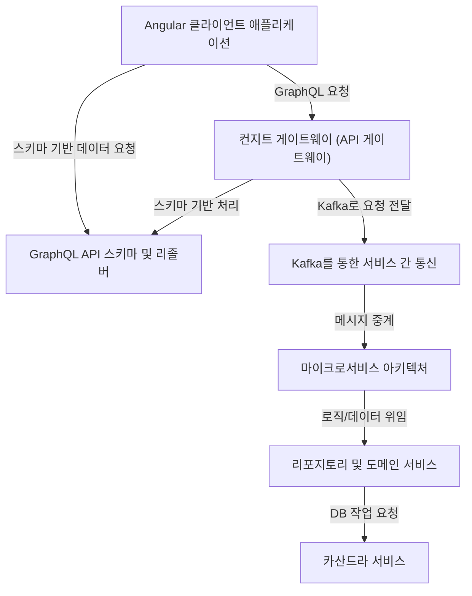

# Tutorial: Serverless-RealWorld

이 프로젝트는 **RealWorld** 사양을 시연하는 풀스택 애플리케이션입니다. 백엔드는 **NestJS**와 *마이크로서비스 아키텍처*를 기반으로 하며, 프론트엔드는 **Angular**로 구축되었습니다. 클라이언트와 서버 간의 데이터 통신은 **GraphQL** API 게이트웨이를 통해 이루어지며, 데이터는 **카산드라 DB**에 저장됩니다. 각 마이크로서비스들은 *Kafka*를 통해 비동기적으로 메시지를 주고받으며, 이를 통해 전체 시스템의 유연성과 확장성을 높입니다. 이 프로젝트는 실제 웹 애플리케이션에서 사용되는 CRUD 작업, 사용자 인증 등의 핵심 기능 구현을 보여줍니다.

## Chapters

1. [Angular 클라이언트 애플리케이션
](01_angular_클라이언트_애플리케이션_.md)
2. [마이크로서비스 아키텍처
](02_마이크로서비스_아키텍처_.md)
3. [컨지트 게이트웨이 (API 게이트웨이)
](03_컨지트_게이트웨이__api_게이트웨이__.md)
4. [GraphQL API 스키마 및 리졸버
](04_graphql_api_스키마_및_리졸버_.md)
5. [Kafka를 통한 서비스 간 통신
](05_kafka를_통한_서비스_간_통신_.md)
6. [리포지토리 및 도메인 서비스
](06_리포지토리_및_도메인_서비스_.md)
7. [카산드라 서비스
](07_카산드라_서비스_.md)

---

Generated by [AI Codebase Knowledge Builder](https://github.com/The-Pocket/Tutorial-Codebase-Knowledge)